# 🚀 MACHUPS PHASE 2 - TEAM BRIEFING

**Date:** December 6, 2025
**Phase:** Phase 2 - Core Engine Development
**Status:** ⚡ GO TIME
**Target:** Ship production-ready brand generation in 3-4 hours

---

## 📢 URGENT: READ THIS FIRST

### Phase 1 Status: ✅ COMPLETE

We have **enterprise-grade infrastructure** ready to use:

```
✅ Brand orchestrator (coordinates everything)
✅ Penpot MCP integration (mockup generation)
✅ Deployment system (subdomain previews)
✅ Template system (instant fallback)
✅ 28-branch git workflow
✅ Gonads.io demo (complete brand package)
✅ CI/CD pipelines
✅ Documentation (50+ pages)
```

**We saved 81% cost and 95% time vs traditional. Now let's make it REAL.**

---

## 🎯 PHASE 2 MISSION

Build the **4 core AI generators** that turn ideas into brands:

```mermaid
graph LR
    A[User Input] --> B[Analyzer]
    B --> C[Logos]
    B --> D[Tokens]
    D --> E[Components]
    C --> F[🎨 BRAND]
    D --> F
    E --> F
```



### The Generators

| Generator | Time | Output |
|-----------|------|--------|
| **Brand Analyzer** | 30s | Name, colors, typography, personality |
| **Logo Generator** | 45s | 3 variations (SVG + PNG) |
| **Token Generator** | 15s | W3C DTCG tokens (4 formats) |
| **Component Generator** | 60s | 30+ React components |
| **TOTAL** | **2.5min** | Complete brand package |

---

## ⚠️ CRITICAL: MERGE ORDER

**DO NOT MERGE OUT OF ORDER OR YOU'LL BREAK EVERYTHING**

### Safe Merge Sequence

```bash
# Step 1: Merge Phase 1 branches (IN THIS ORDER)
git checkout main
git pull origin main
git checkout -b phase-1-foundation

# FIRST: Coordinator (base infrastructure)
git merge --no-ff origin/claude/phase-1-coordinator-agent-016s6daPN3GTf1C8DFmdhmU9

# SECOND: Claude AI client
git merge --no-ff origin/claude/claude-ai-integration-016s6daPN3GTf1C8DFmdhmU9

# THIRD: Base generators
git merge --no-ff origin/claude/generators-016s6daPN3GTf1C8DFmdhmU9

git push origin phase-1-foundation

# Step 2: Merge to main
git checkout main
git merge --no-ff phase-1-foundation -m "feat: Phase 1 infrastructure complete"
git push origin main
git tag -a v1.1.0 -m "Phase 1 complete"
git push origin v1.1.0

# Step 3: Create Phase 2 branch
git checkout -b phase-2-core-engine
git push origin phase-2-core-engine
```

**WHY THIS ORDER MATTERS:**
- Coordinator MUST be first (it orchestrates everything)
- Claude AI MUST be second (analyzer needs it)
- Generators MUST be third (builds on previous)

**IF YOU MERGE WRONG:**
- Merge conflicts
- Broken imports
- CI failures
- Wasted hours debugging

---

## 🏗️ IMPLEMENTATION PLAN

### Hour 1-2: Foundation + Analyzer

**Tasks:**
1. ✅ Merge Phase 1 branches (use commands above)
2. ✅ Verify infrastructure works
3. 🔨 Build brand analyzer
   - `lib/generators/brand-analyzer.ts`
   - Claude AI integration
   - Strategic analysis prompts
   - WCAG color validation

**Success Criteria:**
- Brand analyzer generates name + colors + typography in <30s
- Colors meet WCAG AA contrast (4.5:1 minimum)
- Output matches `BrandAnalysis` interface

**Branch:** `feature/brand-analyzer` → `phase-2-core-engine`

---

### Hour 2-3: Logo Generator

**Tasks:**
1. 🔨 Build logo generator
   - `lib/generators/logo-generator.ts`
   - HTML/CSS → SVG conversion
   - PNG export (2x, 3x retina)
   - 3 variations: wordmark, icon, combination

**Success Criteria:**
- Generates 3 logos in <45s
- SVG exports are valid and scalable
- PNGs are crisp at all resolutions
- Uses brand colors from analyzer

**Branch:** `feature/logo-generator` → `phase-2-core-engine`

---

### Hour 3-4: Tokens + Components

**Tasks:**
1. 🔨 Build token generator
   - `lib/generators/token-generator.ts`
   - W3C DTCG schema compliance
   - Export to 4 formats (JSON, CSS, SCSS, Tailwind)
   - WCAG validation

2. 🔨 Build component generator
   - `lib/generators/component-generator.ts`
   - 30+ React components
   - TypeScript + accessibility
   - Framer Motion animations

**Success Criteria:**
- Tokens generate in <15s
- Components generate in <60s
- 100% WCAG AA compliance
- All exports production-ready

**Branches:**
- `feature/token-generator` → `phase-2-core-engine`
- `feature/component-generator` → `phase-2-core-engine`

---

### Hour 4-5: Integration + Testing

**Tasks:**
1. 🔨 Integrate all generators
   - Update `lib/orchestrator/brand-orchestrator.ts`
   - Add real-time progress updates
   - Error handling + retries

2. 🧪 End-to-end testing
   - Full pipeline test
   - Performance validation (<3min)
   - Manual QA

**Success Criteria:**
- Complete pipeline works
- Total time <3 minutes
- Demo generates actual brands
- Preview deployments work

**Branch:** `feature/integration-pipeline` → `phase-2-core-engine`

---

## 📋 CODE STANDARDS (MUST FOLLOW)

### ✅ DO THIS

```typescript
// Good: Design system, TypeScript, JSDoc
/**
 * Analyzes brand strategy using Claude AI
 * @param input - Brand parameters
 * @returns Strategic brand analysis
 */
export async function analyzeBrand(
  input: BrandInput
): Promise<BrandAnalysis> {
  // Implementation
}
```

```tsx
// Good: Component with design tokens
import { Button } from '@/components/ui/button';

export function BrandForm() {
  return (
    <form className="space-y-md">
      <Button variant="primary">Generate</Button>
    </form>
  );
}
```

### ❌ DON'T DO THIS

```typescript
// Bad: Any types, no docs
export async function analyzeBrand(input: any): Promise<any> {
  // No
}
```

```tsx
// Bad: Inline styles
export function BrandForm() {
  return (
    <form style={{ padding: '20px' }}>
      <button style={{ background: 'blue' }}>Generate</button>
    </form>
  );
}
```

**REMEMBER:**
- ❌ No inline CSS/HTML
- ❌ No `any` types
- ❌ No console.logs in production
- ✅ Use design system
- ✅ TypeScript strict mode
- ✅ JSDoc comments

---

## 🧪 TESTING CHECKLIST

Before merging ANY feature:

- [ ] TypeScript compiles (`pnpm type-check`)
- [ ] ESLint passes (`pnpm lint`)
- [ ] Tests pass (`pnpm test`)
- [ ] Build succeeds (`pnpm build`)
- [ ] Manual testing complete
- [ ] Performance acceptable (<3min total)
- [ ] WCAG AA compliance verified
- [ ] Documentation updated

---

## 🚨 RISK MITIGATION

### If You Get Stuck

**Problem:** Generation takes >3 minutes
- **Solution:** Run generators in parallel
- **Fallback:** Use template system

**Problem:** Claude API rate limits
- **Solution:** Implement retry with backoff
- **Fallback:** Cache similar results

**Problem:** Merge conflicts
- **Solution:** Follow merge order exactly
- **Fallback:** Ask team for help immediately

**Problem:** WCAG compliance fails
- **Solution:** Auto-adjust colors during generation
- **Fallback:** Provide manual override

---

## 📊 SUCCESS METRICS

Phase 2 is DONE when:

### Performance
- ✅ Brand analysis: <30s
- ✅ Logo generation: <45s
- ✅ Token generation: <15s
- ✅ Component generation: <60s
- ✅ **Total: <3 minutes**

### Quality
- ✅ WCAG AA: 100% compliance
- ✅ TypeScript: Strict mode passing
- ✅ Tests: All passing
- ✅ Lighthouse: Score >90

### Completeness
- ✅ 3 logo variations
- ✅ W3C DTCG tokens (4 formats)
- ✅ 30+ React components
- ✅ Brand guidelines PDF
- ✅ Preview deployment working

---

## 🎯 QUICK REFERENCE

### Create Feature Branch

```bash
git checkout phase-2-core-engine
git pull origin phase-2-core-engine
git checkout -b feature/brand-analyzer
```

### Daily Workflow

```bash
# Make changes
git add .
git commit -m "feat(analyzer): add Claude AI integration"
git push origin feature/brand-analyzer
```

### Create PR

Use this template:
```markdown
## Phase 2: Brand Analyzer

### Description
Implements strategic brand analysis using Claude AI

### Testing
- [x] Unit tests pass
- [x] Integration tests pass
- [x] <30s performance
- [x] WCAG AA colors

### Checklist
- [x] TypeScript strict mode
- [x] No inline CSS
- [x] JSDoc comments
- [x] Tests pass
```

### Merge to Phase Branch

```bash
git checkout phase-2-core-engine
git merge --squash feature/brand-analyzer
git commit -m "feat(phase-2): add brand analyzer"
git push origin phase-2-core-engine
git branch -d feature/brand-analyzer
git push origin --delete feature/brand-analyzer
```

---

## 📚 ESSENTIAL READING

**Must read before starting:**

1. [**PHASE_2_STRATEGY.md**](docs/PHASE_2_STRATEGY.md) - Complete implementation guide (30 pages)
2. [**INFRASTRUCTURE_README.md**](INFRASTRUCTURE_README.md) - Phase 1 infrastructure overview
3. [**BRANCHING_STRATEGY.md**](docs/BRANCHING_STRATEGY.md) - Git workflow (28 branches)
4. [**brands/gonads-io/README.md**](brands/gonads-io/README.md) - Demo brand reference

**Reference during development:**
- Phase 1 code (your foundation)
- Gonads.io demo (example output)
- W3C DTCG spec (token format)
- Claude API docs (analyzer integration)

---

## 💬 COMMUNICATION

### Daily Updates
Post in GitHub Discussions:
- What you shipped
- What you're working on
- Blockers (if any)

### PR Reviews
- Required within 2 hours
- Check all quality gates
- Test locally before approving

### Blockers
**Post immediately in GitHub Issues:**
- Clear description
- Impact on timeline
- Suggested solutions
- Tag `@team`

---

## 🎉 TEAM MOTIVATION

**Where We Are:**
- ✅ Phase 1 infrastructure: DONE
- ✅ Demo brand (Gonads.io): DONE
- ✅ Documentation: DONE
- ✅ CI/CD: DONE

**What We're Building:**
The actual AI generators that make brands in <3 minutes

**Why It Matters:**
- Traditional branding: $5k-$50k, 2-4 weeks
- MACHUPS: $10-$49, <3 minutes
- **We're democratizing professional branding**

**The Vision:**
Any founder, anywhere, can get a production-ready brand in minutes, not weeks.

---

## ✅ DEFINITION OF DONE

Phase 2 is **COMPLETE** when:

1. ✅ All 5 features merged to `phase-2-core-engine`
2. ✅ `phase-2-core-engine` merged to `main`
3. ✅ All tests passing
4. ✅ Demo working end-to-end
5. ✅ Performance <3 minutes validated
6. ✅ WCAG AA compliance verified
7. ✅ Documentation updated
8. ✅ Tagged as v1.2.0
9. ✅ Changelog updated
10. ✅ **Team can generate real brands**

---

## 🚀 LET'S SHIP THIS

**Remember:**
1. Follow merge order EXACTLY
2. Use design system (no inline styles)
3. Test thoroughly (performance + quality)
4. Document everything
5. Communicate blockers immediately

**We have 3-4 hours to build the future of branding. Let's go! 🔥**

---

**Questions?** → GitHub Discussions
**Blockers?** → GitHub Issues (tag @team)
**Urgent?** → Drop everything, post in Issues

---

## 📞 TEAM CONTACTS

**Project Lead:** Check GitHub team page
**Documentation:** [docs.machups.com](https://docs.machups.com)
**Repository:** [github.com/4eckd/monad-blitz-sf](https://github.com/4eckd/monad-blitz-sf)

---

**Generated:** December 6, 2025
**Version:** 1.0
**Status:** Ready for Phase 2 Execution

**LET'S BUILD! 🚀🎨💎**
