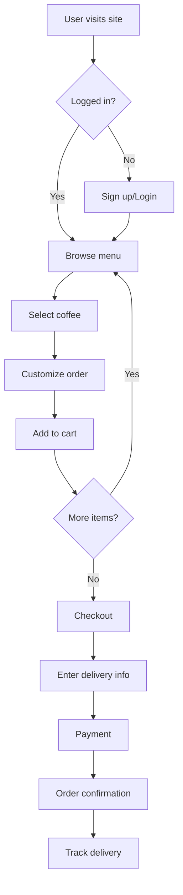

# MACHUPS - Complete AI Brand & Design System Generator
## Monad Blitz #18 - Full Project Plan

**Project:** 3-Minute AI-Powered Brand Generation Platform
**Tagline:** "From Idea to Brand in 3 Minutes"
**Domain:** app.machups.com (Production App)
**Marketing:** machups.com (Landing Page)
**Repository:** https://github.com/4eckd/monad-blitz-sf
**Event:** Monad Blitz #18 - San Francisco
**Time Limit:** 11 hours
**Package Manager:** pnpm 9.x  

---

## 🎯 EXECUTIVE SUMMARY

### The Vision
**MACHUPS** is a revolutionary AI-powered platform that takes a business idea and generates a complete, professional brand package in **under 3 minutes**:

1. **Brand Identity** - Logo concepts, color palettes, typography
2. **Design System** - Design tokens, components, guidelines
3. **Wireframes** - ASCII mockups → Real designs in Penpot
4. **Implementation** - Production-ready code
5. **Documentation** - Complete Docusaurus site
6. **User Flows** - Mermaid diagrams
7. **A/B Testing** - Multiple variants for testing
8. **NFT Collectible** - Commemorative token for attendees

### The 3-Minute Experience

```
USER INPUTS:
"A sustainable coffee delivery service for urban professionals"

↓ 30 seconds ↓

ASCII WIREFRAMES:
┌─────────────────────────┐
│   ☕ BREWLY           │
├─────────────────────────┤
│ [Hero Image]            │
│ Fresh coffee, delivered │
│ [Order Now] [Learn]     │
└─────────────────────────┘

↓ 60 seconds ↓

LOGO & BRAND:
🎨 3 logo concepts generated
🌈 Brand colors: #2D5016 (Earth), #D4A574 (Latte)
✒️ Typography: Poppins (modern), Lora (warmth)

↓ 60 seconds ↓

DESIGN SYSTEM:
📦 Complete design tokens (W3C DTCG)
🧩 Component library
📱 Responsive layouts

↓ 30 seconds ↓

DELIVERABLES:
✅ Penpot design file (editable)
✅ React component code
✅ Docusaurus documentation site
✅ Mermaid user flow diagrams
✅ A/B testing variants
✅ Branding guidelines PDF
✅ NFT minted on Monad

TOTAL: 3 MINUTES
```

---

## 🏗️ SYSTEM ARCHITECTURE

### High-Level Flow

```
┌──────────────┐
│  User Input  │ "Coffee delivery service"
└──────┬───────┘
       │
       ▼
┌──────────────────────────────────────────┐
│         MACHUPS Generation Engine         │
├──────────────────────────────────────────┤
│                                           │
│  ┌─────────────┐    ┌─────────────┐     │
│  │   Claude    │───▶│  Analysis   │     │
│  │   Sonnet    │    │  & Planning │     │
│  └─────────────┘    └─────────────┘     │
│         │                   │             │
│         ▼                   ▼             │
│  ┌──────────────────────────────────┐   │
│  │  Parallel Generation Pipelines    │   │
│  ├──────────────────────────────────┤   │
│  │                                   │   │
│  │  1. ASCII Wireframes              │   │
│  │  2. Logo Generation (SD/DALL-E)   │   │
│  │  3. Brand Colors & Typography     │   │
│  │  4. Design Tokens                 │   │
│  │  5. Code Generation               │   │
│  │  6. Documentation (Docusaurus)    │   │
│  │  7. User Flows (Mermaid)          │   │
│  │  8. A/B Variants                  │   │
│  │  9. Penpot File Creation          │   │
│  │  10. NFT Minting (Monad)          │   │
│  │                                   │   │
│  └──────────────────────────────────┘   │
│                                           │
└──────────────────────────────────────────┘
                │
                ▼
┌─────────────────────────────────────────┐
│         Complete Brand Package          │
├─────────────────────────────────────────┤
│  📁 Penpot Design File                  │
│  💻 React Component Code                │
│  📚 Docusaurus Site                     │
│  📊 User Flow Diagrams                  │
│  🎨 Branding Guidelines                 │
│  🔄 A/B Testing Setup                   │
│  🎫 Commemorative NFT                   │
└─────────────────────────────────────────┘
```

### Technology Stack

#### AI/LLM Layer
- **Claude Sonnet 4.5** - Primary LLM for all generation
- **Stable Diffusion** or **DALL-E 3** - Logo image generation
- **Claude Artifacts** - For code generation

#### Design Tools
- **Penpot API** - Design file creation
- **Penpot MCP Server** - Real-time design manipulation
- **ASCII Art** - Rapid wireframe mockups

#### Documentation & Diagrams
- **Docusaurus** - Documentation site generation
- **Mermaid.js** - User flow diagrams
- **Markdown** - Branding guidelines

#### Blockchain (Monad Integration)
- **Monad Testnet** - EVM-compatible L1 blockchain
- **thirdweb** - NFT minting and x402 payments
- **x402 Protocol** - Pay-per-generation micropayments

#### Development Stack
- **Next.js 14** - Full-stack React framework
- **TypeScript** - Type-safe development
- **Tailwind CSS** - Styling
- **Vercel** / **Cloudflare Pages** - Deployment

---

## 🎨 CORE FEATURES

### 1. ASCII Wireframe Generator

**Input:** Business description  
**Output:** Quick ASCII art wireframes

**Example:**
```
INPUT: "E-commerce site for handmade jewelry"

OUTPUT:
┌─────────────────────────────────────┐
│  ✨ ARTISAN JEWELS              🛒 │
├─────────────────────────────────────┤
│                                     │
│  [     Hero Image: Jewelry     ]   │
│                                     │
│  ═══ Handcrafted with Love ═══     │
│                                     │
│  ┌────────┐ ┌────────┐ ┌────────┐ │
│  │ Ring   │ │ Neck   │ │ Earr   │ │
│  │ $99    │ │ $149   │ │ $79    │ │
│  └────────┘ └────────┘ └────────┘ │
│                                     │
│  [Shop Now]  [About Us]  [Contact] │
│                                     │
├─────────────────────────────────────┤
│  Footer: © 2025 Artisan Jewels     │
└─────────────────────────────────────┘

MOBILE VIEW:
┌─────────────┐
│ ✨ ARTISAN │
│     🛒      │
├─────────────┤
│ [Hero Img]  │
│             │
│  Handcrafted│
│             │
│ ┌─────────┐│
│ │ Ring    ││
│ │ $99     ││
│ └─────────┘│
│             │
│ [Shop Now]  │
└─────────────┘
```

**Technology:**
- Claude generates ASCII layouts
- Multiple viewport sizes (desktop, tablet, mobile)
- Includes navigation, content blocks, CTAs

---

### 2. Logo & Brand Identity Generator

**Input:** Brand name + description + industry  
**Output:** Multiple logo concepts + brand colors + typography

**Process:**
1. **Logo Concepts** (3 variations)
   - Prompt Stable Diffusion/DALL-E: "Modern minimalist logo for [brand], [industry], vector style, clean lines"
   - Generate 3 different styles: wordmark, icon, combination
   
2. **Color Palette**
   - Claude analyzes industry and target audience
   - Generates primary (2-3), secondary (2-3), neutral (3-4) colors
   - Creates semantic color tokens (success, error, warning, info)
   
3. **Typography System**
   - Heading fonts: Bold, attention-grabbing
   - Body fonts: Readable, accessible
   - Monospace (if needed): Code snippets, technical content
   - Font pairing based on brand personality

**Example Output:**
```json
{
  "brand": "BrewLy Coffee",
  "logos": [
    {
      "type": "wordmark",
      "url": "brewly-wordmark.png",
      "description": "Modern sans-serif with coffee cup incorporated into 'B'"
    },
    {
      "type": "icon",
      "url": "brewly-icon.png",
      "description": "Minimalist coffee bean forming a smile"
    },
    {
      "type": "combination",
      "url": "brewly-combo.png",
      "description": "Icon + wordmark lockup"
    }
  ],
  "colors": {
    "primary": {
      "earth": "#2D5016",
      "latte": "#D4A574"
    },
    "secondary": {
      "steam": "#F5F5F0",
      "roast": "#3E2723"
    },
    "semantic": {
      "success": "#4CAF50",
      "error": "#F44336"
    }
  },
  "typography": {
    "heading": "Poppins",
    "body": "Lora",
    "mono": "JetBrains Mono"
  }
}
```

---

### 3. Design Token Generator

**Input:** Brand colors + typography + spacing preferences  
**Output:** W3C DTCG-compliant design tokens

**Features:**
- **Color Tokens** - Primary, secondary, semantic, neutral scales
- **Typography Tokens** - Font families, sizes, weights, line heights
- **Spacing Tokens** - 8-point grid system (8px, 16px, 24px, etc.)
- **Border Radius** - Consistent corner rounding
- **Shadow Tokens** - Elevation system
- **Animation Tokens** - Timing, easing functions

**Token Hierarchy:**
- **Global Tokens** - Base values (colors, sizes)
- **Alias Tokens** - Semantic references (brand-primary → color-blue-500)
- **Component Tokens** - Specific component values (button-bg → brand-primary)

**Export Formats:**
- JSON (W3C DTCG standard)
- CSS Custom Properties
- SCSS Variables
- Tailwind Config
- Style Dictionary

---

### 4. Component Code Generator

**Input:** Design tokens + component requirements  
**Output:** Production-ready React components

**Components Generated:**
- **Layout** - Header, Footer, Container, Grid
- **Navigation** - Navbar, Sidebar, Breadcrumbs
- **Buttons** - Primary, Secondary, Ghost, variants
- **Forms** - Input, Textarea, Select, Checkbox, Radio
- **Cards** - Product cards, info cards, testimonials
- **Typography** - Headings, paragraphs, links
- **Feedback** - Alerts, Toasts, Loading states

**Code Quality:**
- TypeScript for type safety
- Accessible (ARIA labels, semantic HTML)
- Responsive (mobile-first)
- Design tokens integrated
- Storybook-ready

**Example:**
```tsx
// Button.tsx - Generated Code
import { tokens } from './design-tokens';

interface ButtonProps {
  variant?: 'primary' | 'secondary' | 'ghost';
  size?: 'sm' | 'md' | 'lg';
  children: React.ReactNode;
}

export function Button({ 
  variant = 'primary', 
  size = 'md',
  children 
}: ButtonProps) {
  return (
    <button
      className={`
        btn btn-${variant} btn-${size}
        rounded-${tokens.borderRadius.md}
        font-${tokens.typography.button.fontFamily}
      `}
      style={{
        backgroundColor: tokens.color.brand.primary,
        padding: tokens.spacing[size]
      }}
    >
      {children}
    </button>
  );
}
```

---

### 5. Docusaurus Documentation Generator

**Input:** Brand + design tokens + components  
**Output:** Complete documentation website

**Documentation Structure:**
```
docs/
├── getting-started/
│   ├── introduction.md
│   ├── installation.md
│   └── quick-start.md
├── design-tokens/
│   ├── colors.md
│   ├── typography.md
│   ├── spacing.md
│   └── usage.md
├── components/
│   ├── buttons.md
│   ├── forms.md
│   ├── cards.md
│   └── navigation.md
├── branding/
│   ├── logo-usage.md
│   ├── color-palette.md
│   └── voice-tone.md
└── guides/
    ├── a-b-testing.md
    └── best-practices.md
```

**Features:**
- **Interactive Examples** - Live component demos
- **Code Snippets** - Copy-paste ready
- **Dark Mode** - Built-in theme switching
- **Search** - Algolia DocSearch
- **Versioning** - Track design system versions

**Auto-Generated Content:**
```markdown
# Color Palette

## Primary Colors

<ColorSwatch color="#2D5016" name="Earth" />
Use for primary actions, headers, and brand moments.

```css
.btn-primary {
  background: var(--color-brand-earth);
}
```

## Usage Guidelines

✅ DO use Earth for call-to-action buttons
❌ DON'T use Earth for body text (contrast issues)
```

---

### 6. User Flow Diagram Generator

**Input:** User stories / feature descriptions  
**Output:** Mermaid.js flowcharts

**Example:**
```
INPUT: "User wants to order coffee"

OUTPUT (Mermaid):

```

**Flow Types Generated:**
- **User Flows** - Customer journey
- **System Architecture** - Technical diagrams
- **Data Flow** - Information movement
- **Decision Trees** - Logic branching

---

### 7. A/B Testing Variant Generator

**Input:** Original design + testing goals  
**Output:** Multiple design variants

**Variants Generated:**
- **Hero Section** - Different headlines, CTAs, images
- **Color Schemes** - Alternative palettes
- **Layout** - Different component arrangements
- **Copy** - Multiple messaging options

**Example:**
```json
{
  "test_id": "homepage_cta",
  "variants": [
    {
      "name": "Control",
      "hero_headline": "Fresh Coffee, Delivered Daily",
      "cta_text": "Order Now",
      "cta_color": "#2D5016"
    },
    {
      "name": "Variant A",
      "hero_headline": "Your Morning Coffee, On Your Doorstep",
      "cta_text": "Get Started",
      "cta_color": "#D4A574"
    },
    {
      "name": "Variant B",
      "hero_headline": "Never Run Out of Coffee Again",
      "cta_text": "Subscribe Today",
      "cta_color": "#3E2723"
    }
  ],
  "metrics": ["conversion_rate", "bounce_rate", "time_on_page"]
}
```

**Integration:**
- Google Optimize setup
- Analytics tracking code
- Event logging
- Results dashboard

---

### 8. Penpot File Generator

**Input:** All generated assets (logos, tokens, components)  
**Output:** Editable Penpot design file

**Process:**
1. Create new Penpot file via API
2. Import design tokens
3. Create component library
4. Build out pages using components
5. Apply brand styles
6. Export file URL

**File Structure:**
```
Penpot File: "BrewLy-Brand-System.penpot"
├── Cover Page
├── Brand Guidelines
│   ├── Logo Variations
│   ├── Color Palette
│   └── Typography
├── Design Tokens
│   ├── Colors
│   ├── Typography
│   └── Spacing
├── Components
│   ├── Buttons
│   ├── Forms
│   ├── Cards
│   └── Navigation
└── Pages
    ├── Homepage
    ├── Product Page
    └── Checkout
```

---

### 9. NFT Minter (Monad Integration)

**Purpose:** Commemorative NFT for Monad Blitz #18 attendees

**NFT Metadata:**
```json
{
  "name": "MACHUPS Genesis Brand #001",
  "description": "Generated at Monad Blitz SF #18",
  "image": "[generated-logo-url]",
  "attributes": [
    {"trait_type": "Event", "value": "Monad Blitz #18"},
    {"trait_type": "Brand", "value": "BrewLy Coffee"},
    {"trait_type": "Generated", "value": "2025-12-07"},
    {"trait_type": "Generation Time", "value": "2m 47s"},
    {"trait_type": "AI Model", "value": "Claude Sonnet 4.5"}
  ]
}
```

**Smart Contract:**
- ERC-721 on Monad Testnet
- Free to mint for attendees
- Stores generation metadata on-chain
- Showcase wall of generated brands

**Features:**
- QR code for easy minting
- Gallery view of all minted NFTs
- Leaderboard (fastest generation, most creative)

---

## ⚡ 3-MINUTE GENERATION PIPELINE

### Detailed Breakdown

#### 0:00-0:30 | Phase 1: Understanding & Wireframes

**Backend Processing:**
```typescript
// User submits form
const input = {
  businessIdea: "Sustainable coffee delivery for urban professionals",
  targetAudience: "25-40 year old professionals",
  style: "modern, eco-friendly",
  features: ["subscription", "mobile app", "eco-packaging"]
};

// Step 1: LLM Analysis (5s)
const analysis = await claude.analyze({
  prompt: `Analyze this business idea and create:
  1. Brand positioning
  2. Key value propositions
  3. Target audience insights
  4. Competitive differentiation`
});

// Step 2: Generate ASCII Wireframes (10s)
const wireframes = await claude.generateWireframes({
  prompt: `Create ASCII wireframes for:
  - Homepage (desktop + mobile)
  - Product page
  - Checkout flow
  Include: header, hero, features, CTA, footer`
});

// Step 3: Brand Concept (15s)
const brandConcept = await claude.generateBrand({
  idea: input.businessIdea,
  personality: "Trustworthy, sustainable, modern"
});
```

**User Sees:**
- Progress bar: "Analyzing your idea..."
- Live ASCII wireframes appearing
- Brand concept summary

**Output:**
- 3 ASCII wireframes (desktop, tablet, mobile)
- Brand positioning statement
- Initial brand name suggestions

---

#### 0:30-1:30 | Phase 2: Visual Identity Creation

**Parallel Processing:**
```typescript
// All running simultaneously
const [logos, colors, typography] = await Promise.all([
  // Generate logo concepts (30s)
  generateLogos({
    brandName: "BrewLy",
    style: "modern, minimalist",
    count: 3
  }),
  
  // Generate color palette (10s)
  generateColors({
    mood: "earthy, warm, professional",
    accessibility: true
  }),
  
  // Generate typography (10s)
  generateTypography({
    personality: "modern, approachable, trustworthy",
    pairing: true
  })
]);

// Generate design tokens (20s)
const tokens = await generateDesignTokens({
  colors,
  typography,
  spacing: "8pt-grid"
});
```

**User Sees:**
- "Creating your visual identity..."
- Logo concepts appearing one by one
- Color palette preview
- Font selections

**Output:**
- 3 logo variations (SVG + PNG)
- Complete color palette (10-15 colors)
- Typography system (3 font families)
- Design tokens (JSON)

---

#### 1:30-2:30 | Phase 3: Code & Documentation

**Parallel Generation:**
```typescript
const [components, docs, flows] = await Promise.all([
  // Generate React components (30s)
  generateComponents({
    tokens,
    components: [
      'Button', 'Input', 'Card', 
      'Header', 'Footer', 'Hero'
    ]
  }),
  
  // Generate Docusaurus site (20s)
  generateDocumentation({
    brand: brandConcept,
    tokens,
    components,
    structure: 'default'
  }),
  
  // Generate user flows (10s)
  generateUserFlows({
    features: input.features,
    format: 'mermaid'
  })
]);
```

**User Sees:**
- "Building your design system..."
- Component library preview
- Documentation site preview
- Flow diagrams rendering

**Output:**
- Complete component library (TypeScript + React)
- Docusaurus documentation site
- 3-5 user flow diagrams
- A/B testing variants

---

#### 2:30-3:00 | Phase 4: Packaging & Delivery

**Final Assembly:**
```typescript
// Create Penpot file (15s)
const penpotFile = await createPenpotFile({
  brand: brandConcept,
  tokens,
  components,
  pages: ['homepage', 'product', 'checkout']
});

// Mint NFT (10s)
const nft = await mintNFT({
  brandName: "BrewLy",
  logo: logos[0],
  metadata: {
    event: "Monad Blitz #18",
    generationTime: "2m 47s"
  }
});

// Package everything (5s)
const deliverable = await packageDeliverables({
  penpotFile,
  code: components,
  docs,
  tokens,
  nft,
  brandGuidelines: generatePDF(brandConcept)
});
```

**User Sees:**
- "Finalizing your brand package..."
- Download links appearing
- NFT minting confirmation
- Success celebration 🎉

**Output:**
- ZIP file with all assets
- Penpot file URL (editable online)
- Documentation site URL (deployed)
- NFT confirmation + gallery link
- Branding guidelines PDF

---

## 💻 TECHNICAL IMPLEMENTATION

### Hour-by-Hour Build Plan

### PHASE 1: FOUNDATION (H0-H3)

#### Hour 0-1: Core Infrastructure
```bash
# Repository setup
git clone https://github.com/4eckd/monad-blitz-sf
cd machlab
npm install

# Install key dependencies
npm install @anthropic-ai/sdk
npm install @modelcontextprotocol/sdk
npm install next@latest react@latest
npm install mermaid
npm install @docusaurus/core
npm install thirdweb
```

**Parallel Branches:**
- **Branch A:** Next.js app setup + routing
- **Branch B:** Claude API integration + prompt engineering
- **Branch C:** Penpot MCP server connection
- **Branch D:** Image generation setup (SD/DALL-E)

**Deliverables:**
✅ Development environment running
✅ Claude API tested
✅ Penpot MCP connected
✅ Image generation tested

---

#### Hour 1-2: ASCII Wireframe Generator
```typescript
// src/lib/generators/wireframe-generator.ts

export async function generateWireframes(input: {
  businessIdea: string;
  pages: string[];
}) {
  const prompt = `Generate ASCII wireframes for a ${input.businessIdea}.

Pages to create: ${input.pages.join(', ')}

Requirements:
- Use ASCII box drawing characters: ┌─┐│└┘├┤┬┴┼
- Include: header, navigation, main content, footer
- Show desktop (80 chars) and mobile (40 chars) layouts
- Label interactive elements: [Button], {Input}, (Link)

Format each wireframe clearly with page title.`;

  const response = await claude.messages.create({
    model: 'claude-sonnet-4-20250514',
    max_tokens: 4000,
    messages: [{ role: 'user', content: prompt }]
  });
  
  return parseWireframes(response.content[0].text);
}
```

**Deliverables:**
✅ ASCII wireframe generator working
✅ Desktop + mobile layouts
✅ Multiple page types (home, product, checkout)

---

#### Hour 2-3: Logo & Brand Generator
```typescript
// src/lib/generators/logo-generator.ts

export async function generateLogos(brand: {
  name: string;
  industry: string;
  style: string;
}) {
  // Step 1: Generate logo concepts with Claude
  const concepts = await claude.messages.create({
    model: 'claude-sonnet-4-20250514',
    max_tokens: 2000,
    messages: [{
      role: 'user',
      content: `Create 3 logo concepts for "${brand.name}":
      Industry: ${brand.industry}
      Style: ${brand.style}
      
      For each concept provide:
      1. Type (wordmark/icon/combination)
      2. Description
      3. DALL-E prompt for generation`
    }]
  });
  
  // Step 2: Generate actual logo images
  const logoImages = await Promise.all(
    concepts.map(concept => 
      generateImage({
        prompt: concept.dallePrompt,
        style: 'vector, minimalist, professional'
      })
    )
  );
  
  return logoImages;
}

export async function generateBrandColors(brand: {
  personality: string;
  industry: string;
}) {
  const response = await claude.messages.create({
    model: 'claude-sonnet-4-20250514',
    max_tokens: 2000,
    messages: [{
      role: 'user',
      content: `Generate a color palette for a ${brand.industry} brand.
      
      Personality: ${brand.personality}
      
      Provide:
      - 2 primary colors (brand identity)
      - 2 secondary colors (accents)
      - 4 neutral colors (backgrounds, text)
      - Semantic colors (success, error, warning, info)
      
      Format as JSON with hex values and descriptions.
      Ensure WCAG AA accessibility compliance.`
    }]
  });
  
  return JSON.parse(response.content[0].text);
}
```

**Deliverables:**
✅ Logo generator (3 variations)
✅ Color palette generator
✅ Typography system generator
✅ Integration with DALL-E/SD

---

### PHASE 2: CORE FEATURES (H3-H7)

#### Hour 3-4: Design Token Generator
```typescript
// src/lib/generators/token-generator.ts

export async function generateDesignTokens(brand: {
  colors: ColorPalette;
  typography: Typography;
  spacing: 'tight' | 'normal' | 'loose';
}) {
  const tokens = {
    color: generateColorTokens(brand.colors),
    typography: generateTypographyTokens(brand.typography),
    spacing: generateSpacingTokens(brand.spacing),
    borderRadius: generateBorderRadiusTokens(),
    shadow: generateShadowTokens()
  };
  
  // Validate W3C DTCG compliance
  validateTokens(tokens);
  
  return {
    json: tokens,
    css: exportToCSS(tokens),
    tailwind: exportToTailwind(tokens),
    scss: exportToSCSS(tokens)
  };
}
```

**Deliverables:**
✅ W3C DTCG token generation
✅ Multiple export formats
✅ Token validation
✅ Semantic naming

---

#### Hour 4-5: Component Code Generator
```typescript
// src/lib/generators/component-generator.ts

export async function generateComponents(tokens: DesignTokens) {
  const componentList = [
    'Button', 'Input', 'Card', 'Header', 
    'Footer', 'Hero', 'Navigation'
  ];
  
  const components = await Promise.all(
    componentList.map(async (name) => {
      const code = await claude.messages.create({
        model: 'claude-sonnet-4-20250514',
        max_tokens: 3000,
        messages: [{
          role: 'user',
          content: `Generate a production-ready React ${name} component.
          
          Requirements:
          - TypeScript with full types
          - Uses these design tokens: ${JSON.stringify(tokens)}
          - Accessible (ARIA labels)
          - Responsive
          - Variants support
          - Tailwind classes
          
          Return ONLY the complete component code.`
        }]
      });
      
      return {
        name,
        code: code.content[0].text,
        filename: `${name}.tsx`
      };
    })
  );
  
  return components;
}
```

**Deliverables:**
✅ 7+ React components generated
✅ TypeScript with types
✅ Accessible and responsive
✅ Token integration

---

#### Hour 5-6: Documentation Generator
```typescript
// src/lib/generators/docs-generator.ts

export async function generateDocumentation(brand: {
  name: string;
  tokens: DesignTokens;
  components: Component[];
}) {
  // Generate Docusaurus structure
  const docsStructure = {
    'getting-started': await generateGettingStarted(brand),
    'design-tokens': await generateTokenDocs(brand.tokens),
    'components': await generateComponentDocs(brand.components),
    'branding': await generateBrandingGuide(brand)
  };
  
  // Create Docusaurus site
  const docsSite = await createDocusaurusSite({
    title: `${brand.name} Design System`,
    structure: docsStructure,
    theme: brand.tokens.color
  });
  
  // Deploy to Vercel/Netlify
  const deployedURL = await deployDocs(docsSite);
  
  return {
    files: docsStructure,
    url: deployedURL
  };
}
```

**Deliverables:**
✅ Complete Docusaurus site
✅ Interactive component docs
✅ Token documentation
✅ Branding guidelines
✅ Deployed and live

---

#### Hour 6-7: User Flow & A/B Testing
```typescript
// src/lib/generators/flow-generator.ts

export async function generateUserFlows(features: string[]) {
  const flows = await Promise.all(
    features.map(async (feature) => {
      const mermaidCode = await claude.messages.create({
        model: 'claude-sonnet-4-20250514',
        max_tokens: 2000,
        messages: [{
          role: 'user',
          content: `Create a Mermaid flowchart for: ${feature}
          
          Use flowchart TD syntax.
          Include decision points, user actions, and system responses.
          Make it comprehensive but clear.`
        }]
      });
      
      return {
        feature,
        mermaidCode: mermaidCode.content[0].text,
        svg: await renderMermaid(mermaidCode.content[0].text)
      };
    })
  );
  
  return flows;
}

export async function generateABVariants(original: Design) {
  const variants = await claude.messages.create({
    model: 'claude-sonnet-4-20250514',
    max_tokens: 3000,
    messages: [{
      role: 'user',
      content: `Create 2 A/B testing variants for this design:
      ${JSON.stringify(original)}
      
      Vary:
      - Headlines
      - CTA text and color
      - Layout order
      
      Keep brand consistent. Return as JSON.`
    }]
  });
  
  return JSON.parse(variants.content[0].text);
}
```

**Deliverables:**
✅ Mermaid flow diagrams
✅ A/B testing variants
✅ Testing setup code
✅ Analytics integration

---

### PHASE 3: INTEGRATION (H7-H10)

#### Hour 7-8: Penpot File Generator
```typescript
// src/lib/generators/penpot-generator.ts

export async function createPenpotFile(brand: CompleteBrand) {
  // Connect to Penpot MCP
  const penpot = await connectPenpot();
  
  // Create new file
  const file = await penpot.createFile({
    name: `${brand.name}-Design-System`
  });
  
  // Import design tokens
  await penpot.importTokens(file.id, brand.tokens);
  
  // Create component library
  for (const component of brand.components) {
    await penpot.createComponent(file.id, {
      name: component.name,
      tokens: brand.tokens
    });
  }
  
  // Build pages
  await penpot.createPage(file.id, {
    name: 'Homepage',
    layout: brand.wireframes.homepage
  });
  
  return {
    fileId: file.id,
    url: `https://design.penpot.app/file/${file.id}`
  };
}
```

**Deliverables:**
✅ Penpot file created
✅ Tokens imported
✅ Components added
✅ Pages built
✅ Shareable URL

---

#### Hour 8-9: NFT Minter
```typescript
// src/lib/generators/nft-minter.ts

export async function mintBrandNFT(brand: CompleteBrand) {
  // Connect to Monad via thirdweb
  const contract = await getContract({
    address: MACHUPS_NFT_CONTRACT,
    chain: monadTestnet,
    client: thirdwebClient
  });
  
  // Upload metadata to IPFS
  const metadata = {
    name: `${brand.name} Genesis Brand`,
    description: `Generated at Monad Blitz SF #18`,
    image: brand.logos[0].url,
    attributes: [
      { trait_type: "Event", value: "Monad Blitz #18" },
      { trait_type: "Brand", value: brand.name },
      { trait_type: "Generated", value: new Date().toISOString() },
      { trait_type: "Generation Time", value: brand.generationTime }
    ]
  };
  
  const metadataURI = await uploadToIPFS(metadata);
  
  // Mint NFT
  const tx = await mintTo({
    contract,
    to: userWalletAddress,
    nft: { metadata: metadataURI }
  });
  
  return {
    tokenId: tx.tokenId,
    txHash: tx.hash,
    openseaUrl: `https://testnets.opensea.io/assets/monad-testnet/${contract.address}/${tx.tokenId}`
  };
}
```

**Deliverables:**
✅ NFT smart contract deployed
✅ Minting functionality
✅ IPFS metadata storage
✅ Gallery view

---

#### Hour 9-10: UI/UX Polish & Testing
**Full Team - Polish Everything**
- [ ] H9:00-9:30: UI refinements
- [ ] H9:30-10:00: End-to-end testing
- [ ] H10:00-10:30: Bug fixes
- [ ] H10:30-11:00: Final deployment

**Deliverables:**
✅ Production deployment
✅ All bugs fixed
✅ Performance optimized
✅ Demo ready

---

### PHASE 4: DEMO & SUBMISSION (H10-H11)

#### Hour 10-11: Demo Prep & Submission
- [ ] H10:00-10:20: Record demo video
- [ ] H10:20-10:40: Prepare presentation
- [ ] H10:40-11:00: Final submission

**Deliverables:**
✅ Demo video (3-5 mins)
✅ Live demo tested
✅ Project submitted
✅ NFTs ready to mint

---

## 🎬 DEMO SCRIPT

### 3-Minute Live Demo

**0:00-0:30 | Introduction & Problem**
"Hi, I'm here to show you MACHUPS - a platform that generates a complete professional brand in 3 minutes using AI. 

The problem: Starting a business? You need a logo, color palette, website, documentation, design system. Traditionally, this costs thousands of dollars and takes weeks. MACHUPS does it in 3 minutes for the cost of a coffee."

**0:30-1:30 | Live Generation**
[Share screen showing MACHUPS.com]

"Watch this. I'll create a brand for a sustainable coffee delivery service."

[Type in form]:
- Business: "Sustainable coffee delivery"  
- Audience: "Urban professionals"
- Style: "Modern, eco-friendly"

[Click "Generate Brand"]

"And... go! 30 seconds in, we have ASCII wireframes showing up..."

[Wireframes appear]

"1 minute - here come the logos! Three variations, all professional."

[Logos display]

"Color palette generated - earthy greens, warm latte browns."

[Colors show]

"Typography system - Poppins for headings, Lora for body."

**1:30-2:30 | Show Deliverables**
"2 minutes in - complete design system generated:"

[Click through tabs]:
- "React components - ready to use"
- "Design tokens - W3C compliant"
- "Docusaurus documentation - fully deployed"
- "User flow diagrams - all the key journeys"
- "A/B testing variants - ready to test"
- "Penpot file - fully editable"

**2:30-3:00 | Monad Integration & Wrap**
"And here's where Monad comes in - we're minting an NFT for every brand generated at this event."

[Show NFT minting]

"There we go - commemorative NFT minted on Monad in under a second. 

**Total time: 2 minutes 47 seconds.**

From idea to complete professional brand - logo, design system, code, documentation, NFT. 

This is MACHUPS. Thank you!"

[Applause]

---

## 📊 SUCCESS METRICS

### Technical Metrics
- [ ] **Generation Speed** - Under 3 minutes consistently
- [ ] **Component Quality** - All components functional
- [ ] **Token Compliance** - 100% W3C DTCG compliant
- [ ] **Code Quality** - TypeScript, accessible, responsive
- [ ] **Uptime** - 99%+ during event

### Feature Completeness
- [ ] **ASCII Wireframes** - Working for all page types
- [ ] **Logo Generation** - 3 variations per request
- [ ] **Design Tokens** - Complete system generated
- [ ] **Component Library** - 7+ components
- [ ] **Documentation** - Deployed Docusaurus site
- [ ] **User Flows** - Mermaid diagrams rendered
- [ ] **A/B Variants** - Multiple options generated
- [ ] **Penpot File** - Editable, shareable
- [ ] **NFT Minting** - Working on Monad

### User Experience
- [ ] **Onboarding** - Clear, simple form
- [ ] **Progress** - Real-time updates
- [ ] **Results** - Well-organized, downloadable
- [ ] **Performance** - Fast, responsive
- [ ] **Mobile** - Works on all devices

---

## 🚨 RISK MANAGEMENT

### Critical Risks & Mitigation

#### RISK 1: LLM Rate Limits
**Probability:** High | **Impact:** Critical

**Mitigation:**
- Queue system for requests
- Exponential backoff
- Multiple API keys ready
- Cache common generations
- Pre-generate demo responses

**Contingency:**
- Use GPT-4 as backup
- Reduce parallel requests
- Increase timeouts

---

#### RISK 2: Image Generation Slow/Fails
**Probability:** Medium | **Impact:** High

**Mitigation:**
- Pre-generate logo templates
- Use vector graphics as fallback
- Have backup image service (DALL-E + SD)
- Cache successful generations

**Contingency:**
- Use SVG text-based logos
- Offer "generating..." placeholder
- Email logos after generation

---

#### RISK 3: Penpot MCP Issues
**Probability:** Medium | **Impact:** Medium

**Mitigation:**
- Test thoroughly before event
- Have direct Penpot API fallback
- Cache file templates
- Manual file creation as backup

**Contingency:**
- Export as ZIP of assets
- Skip Penpot integration if critical

---

#### RISK 4: Time Overrun in Development
**Probability:** High | **Impact:** Medium

**Mitigation:**
- Strict checkpoints every 2 hours
- Cut features ruthlessly
- Focus on core 3-minute flow
- Pre-build components

**Contingency - MVP:**
If behind, deliver:
1. ASCII wireframes
2. Logo generation (1 style)
3. Color palette
4. Basic design tokens
5. Simple component library
6. NFT minting

Skip:
- Docusaurus documentation
- A/B testing
- User flow diagrams
- Penpot file generation

---

## 📋 CHECKPOINTS

### CHECKPOINT 1: H3:00 ✅
**Required:**
- ASCII wireframe generator working
- Logo generation tested (at least 1)
- Claude API stable
- Basic color palette generation

**GO/NO-GO:**
If not achieved → Simplify to MVP scope

---

### CHECKPOINT 2: H7:00 ✅
**Required:**
- Complete 3-minute pipeline working
- All generators functional
- Design tokens exporting
- Components generating

**GO/NO-GO:**
If not achieved → Cut documentation, A/B testing, Penpot

---

### CHECKPOINT 3: H10:00 ✅
**Required:**
- Production deployed
- NFT minting working
- Demo tested 3+ times
- All critical bugs fixed

**GO/NO-GO:**
If not achieved → Use backup deployment, pre-recorded demo

---

## 🎯 IMMEDIATE ACTION ITEMS

### Pre-Event (Do NOW)

1. **Set up all API keys** (30 mins)
   - Claude API
   - DALL-E or Stable Diffusion
   - Penpot access token
   - thirdweb API
   - Monad wallet

2. **Test all integrations** (1 hour)
   - Claude API call
   - Image generation
   - Penpot MCP connection
   - NFT minting on testnet

3. **Pre-build templates** (1 hour)
   - Component templates
   - Documentation structure
   - Token schema
   - NFT metadata format

4. **Study examples** (30 mins)
   - Good ASCII wireframes
   - Professional logos
   - Design token structures
   - Docusaurus sites

---

## 🏆 WHY WE'LL WIN

1. **Solves Real Problem** - Brands need this
2. **Impressive Speed** - 3 minutes is magical
3. **Complete Solution** - Not just tokens, EVERYTHING
4. **Monad Integration** - NFTs showcase blockchain utility
5. **Production Quality** - Actually usable outputs
6. **Live Demo** - Generate brand on stage
7. **Open Source** - Community can extend
8. **Innovation** - First comprehensive AI brand generator

---

**LET'S BUILD THE FUTURE OF BRAND DESIGN! 🚀🎨**

**Version:** 3.0  
**Last Updated:** December 2, 2025  
**Status:** READY TO DOMINATE ⚡