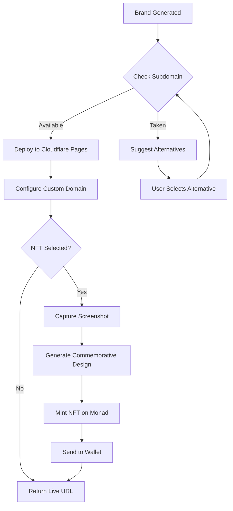

# Auto Deploy Feature

## Overview

Automatically deploy generated brand packages to live, publicly accessible subdomains on machups.com with optional commemorative NFT minting.

## Status

🟡 **In Progress**

## Goals

1. **Instant Live Demos** - Users see their brand live within seconds of generation
2. **Zero Configuration** - No manual deployment steps required
3. **Memorable URLs** - Brand-specific subdomains (e.g., hero.machups.com)
4. **NFT Certificates** - Optional commemorative NFT with screenshot
5. **Subdomain Management** - Automatic availability checking and allocation

## User Flow



## Key Features

### 1. Subdomain Availability
- Real-time DNS checking
- Alternative suggestions if taken
- Brand name normalization (spaces, special chars)
- Subdomain reservation during generation

### 2. Cloudflare Pages Deployment
- Automated build and deploy
- Custom subdomain configuration
- SSL certificate provisioning
- Edge caching optimization

### 3. Screenshot Capture
- Puppeteer-based rendering
- Multiple viewport sizes
- Above-the-fold capture
- Optimized for NFT display

### 4. Commemorative NFT
- Monad Blitz SF #18 branding
- Screenshot as NFT image
- Metadata including:
  - Brand name
  - Generation timestamp
  - Subdomain URL
  - Event details
  - Design system hash

## Technical Requirements

### Dependencies
- `puppeteer` - Screenshot capture
- `@cloudflare/api` - Cloudflare API client
- `thirdweb` - NFT minting
- `dns` (Node.js built-in) - Subdomain checking

### Environment Variables
```bash
CLOUDFLARE_API_TOKEN=xxxxx
CLOUDFLARE_ACCOUNT_ID=xxxxx
CLOUDFLARE_ZONE_ID=xxxxx
MACHUPS_DOMAIN=machups.com
IPFS_API_KEY=xxxxx (for NFT metadata)
```

### API Endpoints
- `POST /api/deploy/check-subdomain` - Check availability
- `POST /api/deploy/create` - Initiate deployment
- `GET /api/deploy/status/:id` - Check deployment status
- `POST /api/deploy/mint-nft` - Mint commemorative NFT

## Success Metrics

### Performance
- Deployment time: < 60 seconds
- Screenshot capture: < 10 seconds
- NFT minting: < 30 seconds
- Total time to live URL: < 90 seconds

### Reliability
- Deployment success rate: > 99%
- Subdomain conflict rate: < 1%
- NFT minting success: > 95%

### User Experience
- URL memorability score: > 8/10
- NFT claim rate: > 70% (of eligible users)
- Subdomain satisfaction: > 90%

## Edge Cases

### Subdomain Conflicts
- Handle race conditions during checking
- Provide 5 alternative suggestions
- Allow custom subdomain input

### Deployment Failures
- Retry mechanism (3 attempts)
- Rollback on failure
- User notification with error details

### NFT Minting Failures
- Queue for retry
- Don't block deployment on NFT failure
- Provide claim link if minting delayed

## Security Considerations

- Subdomain validation (prevent phishing)
- Rate limiting on deployments
- Wallet verification before NFT mint
- Content moderation for screenshots
- DDoS protection on subdomains

## Future Enhancements

- Custom domain support (BYOD)
- Deployment analytics dashboard
- Version history and rollback
- Multi-region deployments
- A/B test deployments

---

**Feature Owner**: Auto Deploy Team
**Priority**: High
**Target Release**: v0.3.0
**Dependencies**: Brand Generator, NFT Minting System
