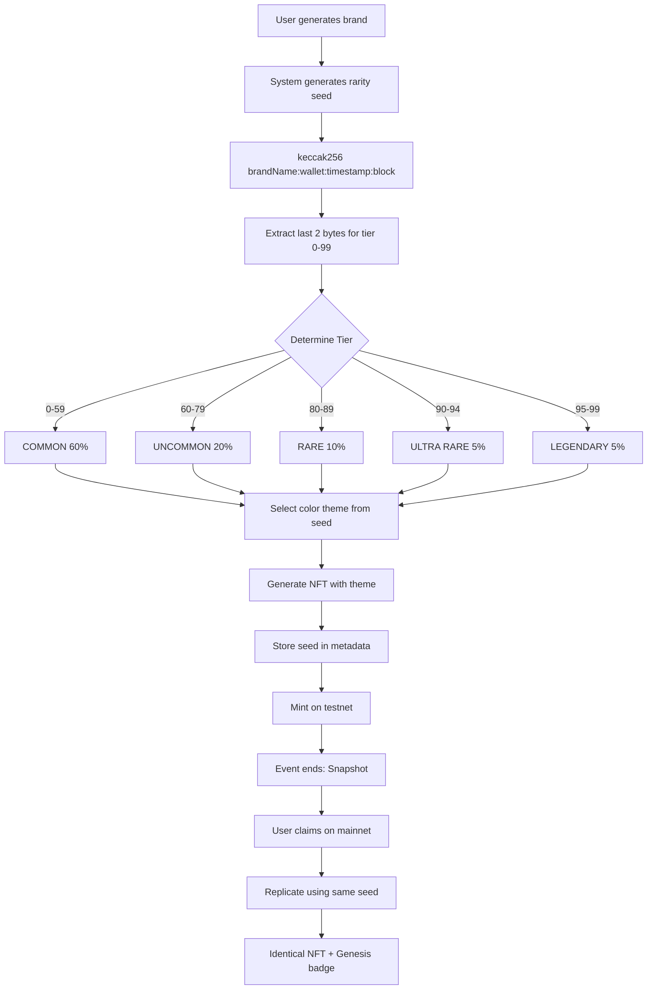

# NFT Rarity System - Feature Plan

## Overview

Deterministic NFT rarity system for MACHUPS certificates that ensures identical rarity and visual appearance when migrating from Monad Testnet to Mainnet during airdrop.

**Milestone**: Phase 1, Step 2
**Dependencies**: None (can develop in parallel with auto-deploy)
**Branch**: `feature/nft-rarity`
**Version**: v0.3.0-alpha.2
**Estimated Effort**: 2-3 days

---

## Goals

### Primary Goals
- ✅ Deterministic rarity seed generation using cryptographic hash
- ✅ 5-tier rarity system (COMMON, UNCOMMON, RARE, ULTRA RARE, LEGENDARY)
- ✅ Consistent color theme selection based on seed
- ✅ Testnet → Mainnet migration preserving exact visual appearance
- ✅ On-chain verifiable fairness

### Success Criteria
- [ ] Seed generation produces consistent results for same inputs
- [ ] Rarity distribution matches expected probabilities (60/20/10/5/5%)
- [ ] Same seed produces identical NFT on testnet and mainnet
- [ ] Color themes map correctly to rarity tiers
- [ ] System is verifiable and tamper-proof

---

## Technical Architecture

### Seed Generation Algorithm
```typescript
function generateRaritySeed(
  brandName: string,
  walletAddress: string,
  timestamp: number,
  blockNumber: number
): string {
  const input = `${brandName}:${walletAddress}:${timestamp}:${blockNumber}`;
  return keccak256(input);
}
```

### Rarity Tier Mapping
```typescript
function determineRarityTier(seed: string): RarityTier {
  // Use last 2 bytes of seed as random number (0-65535)
  const randomValue = parseInt(seed.slice(-4), 16) % 100;

  if (randomValue < 60) return 'COMMON';          // 0-59 (60%)
  if (randomValue < 80) return 'UNCOMMON';        // 60-79 (20%)
  if (randomValue < 90) return 'RARE';            // 80-89 (10%)
  if (randomValue < 95) return 'ULTRA_RARE';      // 90-94 (5%)
  return 'LEGENDARY';                              // 95-99 (5%)
}
```

### Color Theme Selection
```typescript
function selectColorTheme(tier: RarityTier, seed: string): string {
  const themes = COLOR_THEMES[tier];
  const themeIndex = parseInt(seed.slice(-6, -4), 16) % themes.length;
  return themes[themeIndex];
}
```

---

## User Flow



---

## Implementation Plan

### Phase 1: Core Rarity Engine
**File**: `lib/nft/rarity-engine.ts`

**Functions to implement**:
- `generateRaritySeed(brandName, walletAddress, timestamp, blockNumber): string`
- `determineRarityTier(seed: string): RarityTier`
- `selectColorTheme(tier: RarityTier, seed: string): string`
- `validateSeed(seed: string): boolean`
- `verifyRarityDistribution(seeds: string[]): DistributionStats`

**Unit Tests**:
- Seed generation is deterministic (same inputs = same output)
- Rarity tier mapping is correct
- Color theme selection is consistent
- Distribution approaches expected probabilities over 10,000 samples

---

### Phase 2: Airdrop Verifier
**File**: `lib/nft/airdrop-verifier.ts`

**Functions to implement**:
- `createSnapshot(contractAddress: string): Promise<Snapshot>`
- `generateMerkleTree(snapshot: Snapshot): MerkleTree`
- `generateMerkleProof(wallet: string, snapshot: Snapshot): string[]`
- `verifyMerkleProof(wallet: string, proof: string[], root: string): boolean`
- `checkEligibility(wallet: string): Promise<EligibilityResult>`

**Integration Tests**:
- Snapshot captures all testnet holders
- Merkle tree generation is correct
- Proofs verify correctly
- Ineligible addresses are rejected

---

### Phase 3: Smart Contracts
**Files**:
- `contracts/MACHUPSCertificate.sol` (Testnet)
- `contracts/MACHUPSMainnetCertificate.sol` (Mainnet)

**Testnet Contract Features**:
- ERC-721 standard implementation
- Store rarity seed in token metadata
- Emit events for snapshot creation
- Pausable for emergency stops

**Mainnet Contract Features**:
- ERC-721 with airdrop claim function
- Merkle proof verification
- One claim per seed enforcement
- Genesis Edition flag
- Provenance tracking (testnet token ID, claim block, etc.)

**Contract Tests**:
- Minting works correctly
- Seed storage and retrieval
- Airdrop claim with valid proof succeeds
- Airdrop claim with invalid proof fails
- Double-claim prevention works

---

### Phase 4: API Routes
**Files**:
- `app/api/nft/generate-seed/route.ts`
- `app/api/nft/check-eligibility/route.ts`
- `app/api/nft/claim/route.ts`

**Endpoints**:

#### POST `/api/nft/generate-seed`
```typescript
Request: {
  brandName: string;
  walletAddress: string;
}

Response: {
  seed: string;
  tier: RarityTier;
  colorTheme: string;
  probability: number;
}
```

#### GET `/api/nft/check-eligibility`
```typescript
Query: { wallet: string }

Response: {
  eligible: boolean;
  nfts: Array<{
    tokenId: string;
    seed: string;
    tier: RarityTier;
    theme: string;
    claimable: boolean;
  }>;
}
```

#### POST `/api/nft/claim`
```typescript
Request: {
  walletAddress: string;
  seed: string;
  proof: string[];
}

Response: {
  txHash: string;
  tokenId: string;
  status: 'pending' | 'minted';
}
```

---

## Deliverables

### Code
- [ ] `lib/nft/rarity-engine.ts` - Core rarity logic
- [ ] `lib/nft/airdrop-verifier.ts` - Snapshot and proof system
- [ ] `lib/nft/types.ts` - Type definitions
- [ ] `contracts/MACHUPSCertificate.sol` - Testnet NFT contract
- [ ] `contracts/MACHUPSMainnetCertificate.sol` - Mainnet airdrop contract
- [ ] `app/api/nft/generate-seed/route.ts` - Seed generation API
- [ ] `app/api/nft/check-eligibility/route.ts` - Eligibility check API
- [ ] `app/api/nft/claim/route.ts` - Claim transaction API

### Tests
- [ ] `lib/nft/rarity-engine.test.ts` - Unit tests for core logic
- [ ] `lib/nft/airdrop-verifier.test.ts` - Snapshot and proof tests
- [ ] `contracts/test/MACHUPSCertificate.test.ts` - Contract tests
- [ ] `tests/integration/nft-flow.test.ts` - End-to-end NFT flow

### Documentation
- [x] `prompts/nfts/rarity-system.md` - Technical specification
- [x] `prompts/nfts/TESTNET_TO_MAINNET.md` - Airdrop strategy
- [x] `prompts/nfts/mathematica.yaml` - Rarity tier definitions
- [x] `prompts/nfts/metadata.yaml` - NFT metadata template
- [x] `prompts/nfts/dif.yaml` - Color application rules
- [ ] `docs/guides/NFT_CLAIM_GUIDE.md` - User guide for claiming

---

## Success Metrics

### Functional Metrics
- **Seed determinism**: 100% (same inputs always produce same output)
- **Rarity distribution accuracy**: Within ±2% of expected probabilities over 10,000 samples
- **Testnet-to-mainnet consistency**: 100% (all testnet NFTs replicate identically)
- **Claim success rate**: >99% for eligible users

### Performance Metrics
- **Seed generation**: <10ms
- **Rarity tier determination**: <5ms
- **Merkle proof generation**: <50ms
- **Claim transaction**: <30s on Monad

### Security Metrics
- **Zero manipulation incidents**: Seed cannot be gamed
- **Zero double-claims**: Each seed claimed only once
- **100% verifiable**: All rarity claims can be proven on-chain

---

## Dependencies

### External Libraries
- **ethers.js v6** - Blockchain interactions
- **@thirdweb-dev/sdk** - NFT minting SDK
- **merkletreejs** - Merkle tree generation
- **keccak256** - Cryptographic hashing

### Internal Dependencies
- None (can develop in parallel)

---

## Timeline

| Phase | Duration | Deliverables |
|-------|----------|--------------|
| **Phase 1**: Core Engine | 1 day | rarity-engine.ts + tests |
| **Phase 2**: Airdrop Verifier | 1 day | airdrop-verifier.ts + tests |
| **Phase 3**: Smart Contracts | 1-2 days | Solidity contracts + tests |
| **Phase 4**: API Routes | 0.5 day | API endpoints |
| **Testing & Integration** | 0.5 day | Integration tests, bug fixes |

**Total**: 2-3 days

---

## Risks and Mitigations

### Risk 1: Rarity distribution doesn't match expected probabilities
**Mitigation**: Statistical testing with 10,000+ samples, adjust modulo operation if needed

### Risk 2: Seed collision (two different inputs produce same seed)
**Mitigation**: Use keccak256 which has negligible collision probability (2^-256)

### Risk 3: User loses testnet NFT before snapshot
**Mitigation**: Clear communication about snapshot timing, warning notifications

### Risk 4: Merkle proof verification gas costs too high
**Mitigation**: Use efficient Merkle tree library, optimize proof size

---

## Testing Strategy

### Unit Tests
```bash
npm test lib/nft/rarity-engine.test.ts
npm test lib/nft/airdrop-verifier.test.ts
```

### Integration Tests
```bash
npm test tests/integration/nft-flow.test.ts
```

### Contract Tests
```bash
npx hardhat test contracts/test/MACHUPSCertificate.test.ts
```

### Load Testing
- Generate 10,000 seeds and verify distribution
- Simulate 1,000 concurrent airdrop claims
- Measure Merkle proof generation performance

---

## Merge Checklist

Before merging `feature/nft-rarity` → `develop`:

- [ ] All unit tests pass
- [ ] All integration tests pass
- [ ] Contract tests pass (testnet deployment successful)
- [ ] TypeScript compiles without errors
- [ ] Linter passes with no warnings
- [ ] Documentation complete
- [ ] API routes tested with Postman/curl
- [ ] Statistical distribution test shows ±2% accuracy
- [ ] No merge conflicts with develop
- [ ] Code review approved

**Merge Order Position**: Step 2 of 7 (Phase 1)
**Version Tag**: `v0.3.0-alpha.2`
**Previous Step**: feature/auto-deploy (v0.3.0-alpha.1)
**Next Step**: feature/brand-generation (v0.3.0-alpha.3)

---

**Status**: Design Complete ✅
**Implementation**: Not Started
**Documentation**: Complete
**Testing**: Not Started
