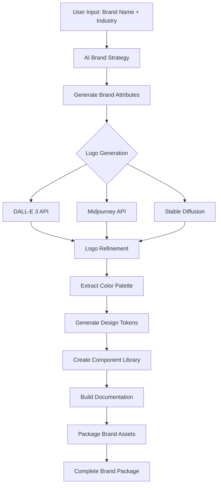

# Brand Generation - Feature Plan

## Overview

AI-powered brand generation system that creates complete brand packages including logo, design system, and component library in under 3 minutes.

**Milestone**: Phase 1, Step 3
**Dependencies**: design-tokens (for token system integration)
**Branch**: `feature/brand-generation`
**Version**: v0.3.0-alpha.3
**Estimated Effort**: 3-4 days

---

## Goals

### Primary Goals
- ✅ Generate complete brand identity in <3 minutes
- ✅ Multi-modal AI (Claude + DALL-E/Midjourney) for logo generation
- ✅ Intelligent industry-specific design decisions
- ✅ Professional-grade output quality
- ✅ Scalable brand package structure

### Success Criteria
- [ ] 95% of generations complete within 3 minutes
- [ ] User satisfaction rating >4.5/5
- [ ] Logo quality rated "professional" by 80%+ of users
- [ ] Design tokens automatically generated and applied
- [ ] Zero placeholder content in final output

---

## Technical Architecture

### Generation Pipeline


---

## User Flow

### Input Collection
```typescript
interface BrandGenerationInput {
  brandName: string;
  industry: string;
  keywords: string[];
  targetAudience?: string;
  brandVoice?: 'professional' | 'playful' | 'bold' | 'minimal';
  colorPreferences?: string[];
}
```

### Generation Stages
1. **AI Brand Strategy** (15s)
   - Analyze industry and keywords
   - Generate brand positioning statement
   - Determine visual direction

2. **Logo Generation** (60s)
   - Generate 3 logo concepts
   - User selects preferred direction
   - Refine selected logo

3. **Color Palette Extraction** (10s)
   - Extract colors from logo
   - Generate complementary colors
   - Create semantic color tokens

4. **Design Token Generation** (20s)
   - Typography scale
   - Spacing system
   - Border radius
   - Shadow system
   - Animation timings

5. **Component Library** (40s)
   - Button variants
   - Input fields
   - Cards
   - Navigation
   - Typography components

6. **Documentation** (15s)
   - Brand guidelines
   - Component usage examples
   - Design token reference

**Total**: ~160s (2 min 40s)

---

## Implementation Plan

### Phase 1: AI Brand Strategy Engine
**File**: `lib/ai/brand-strategy.ts`

**Functions to implement**:
```typescript
async function generateBrandStrategy(
  input: BrandGenerationInput
): Promise<BrandStrategy> {
  // Use Claude to analyze and create brand strategy
  const strategy = await anthropic.messages.create({
    model: 'claude-sonnet-4-5',
    messages: [{
      role: 'user',
      content: `Create a brand strategy for ${input.brandName}...`
    }]
  });

  return {
    positioning: strategy.positioning,
    visualDirection: strategy.visualDirection,
    colorDirection: strategy.colorDirection,
    typographyDirection: strategy.typographyDirection,
    logoPrompt: strategy.logoPrompt
  };
}
```

**Unit Tests**:
- Brand strategy generation for different industries
- Output quality validation
- Response time <15s

---

### Phase 2: Multi-Modal Logo Generation
**File**: `lib/ai/logo-generator.ts`

**Functions to implement**:
```typescript
async function generateLogoConcepts(
  logoPrompt: string,
  brandName: string,
  count: number = 3
): Promise<LogoConcept[]> {
  // Try DALL-E 3 first
  try {
    return await generateWithDALLE3(logoPrompt, count);
  } catch (error) {
    // Fallback to Midjourney
    return await generateWithMidjourney(logoPrompt, count);
  }
}

async function refineLogo(
  selectedConcept: LogoConcept,
  refinements: string[]
): Promise<LogoAsset> {
  // Apply user-requested refinements
  const refined = await applyRefinements(selectedConcept, refinements);

  // Generate multiple formats
  return {
    svg: await convertToSVG(refined),
    png: refined,
    variants: await generateVariants(refined) // light/dark, small/large
  };
}
```

**Integration Tests**:
- Logo generation succeeds with multiple providers
- Fallback works when primary provider fails
- Refinement applies correctly
- Multiple formats generated

---

### Phase 3: Color Palette Extraction
**File**: `lib/ai/color-extraction.ts`

**Functions to implement**:
```typescript
async function extractColorPalette(
  logoImage: Buffer
): Promise<ColorPalette> {
  // Use color quantization algorithm
  const dominantColors = await extractDominantColors(logoImage, 5);

  // Generate semantic tokens
  return {
    primary: dominantColors[0],
    secondary: dominantColors[1],
    accent: dominantColors[2],
    neutral: generateNeutralScale(dominantColors),
    success: generateSemanticColor('success', dominantColors),
    warning: generateSemanticColor('warning', dominantColors),
    error: generateSemanticColor('error', dominantColors)
  };
}

function generateNeutralScale(
  baseColors: string[]
): Record<string, string> {
  // Generate 50-950 neutral scale
  return {
    50: lighten(baseColors[0], 0.95),
    100: lighten(baseColors[0], 0.90),
    // ... 200-900
    950: darken(baseColors[0], 0.95)
  };
}
```

**Unit Tests**:
- Color extraction from various logo styles
- Neutral scale generation
- Semantic color generation
- WCAG contrast compliance

---

### Phase 4: Design Token Generator
**File**: `lib/brand/token-generator.ts`

**Functions to implement**:
```typescript
async function generateDesignTokens(
  colorPalette: ColorPalette,
  brandStrategy: BrandStrategy
): Promise<DesignTokens> {
  return {
    colors: colorPalette,
    typography: generateTypographyTokens(brandStrategy.typographyDirection),
    spacing: generateSpacingScale(),
    borderRadius: generateBorderRadiusTokens(brandStrategy.visualDirection),
    shadows: generateShadowTokens(),
    animation: generateAnimationTokens()
  };
}

function generateTypographyTokens(
  direction: 'modern' | 'classic' | 'playful'
): TypographyTokens {
  const fontPairs = {
    modern: { heading: 'Inter', body: 'Inter' },
    classic: { heading: 'Playfair Display', body: 'Source Sans Pro' },
    playful: { heading: 'Poppins', body: 'Nunito' }
  };

  const fonts = fontPairs[direction];

  return {
    fontFamily: {
      heading: fonts.heading,
      body: fonts.body,
      mono: 'JetBrains Mono'
    },
    fontSize: generateModularScale(16, 1.25), // Base 16px, ratio 1.25
    fontWeight: { light: 300, regular: 400, medium: 500, bold: 700 },
    lineHeight: { tight: 1.2, normal: 1.5, relaxed: 1.75 }
  };
}
```

**Unit Tests**:
- Token generation for different brand directions
- Modular scale calculation
- Token structure validation

---

### Phase 5: Component Library Generator
**File**: `lib/brand/component-generator.ts`

**Functions to implement**:
```typescript
async function generateComponentLibrary(
  tokens: DesignTokens,
  brandName: string
): Promise<ComponentLibrary> {
  const components = await Promise.all([
    generateButtonComponent(tokens),
    generateInputComponent(tokens),
    generateCardComponent(tokens),
    generateNavigationComponent(tokens),
    generateTypographyComponents(tokens)
  ]);

  return {
    components,
    examples: generateExamples(components, tokens),
    documentation: generateComponentDocs(components)
  };
}

function generateButtonComponent(tokens: DesignTokens): ComponentCode {
  return {
    name: 'Button',
    code: `
export function Button({ variant = 'primary', size = 'md', children, ...props }) {
  const variants = {
    primary: 'bg-primary-600 hover:bg-primary-700 text-white',
    secondary: 'bg-secondary-600 hover:bg-secondary-700 text-white',
    outline: 'border-2 border-primary-600 text-primary-600 hover:bg-primary-50'
  };

  const sizes = {
    sm: 'px-3 py-1.5 text-sm',
    md: 'px-4 py-2 text-base',
    lg: 'px-6 py-3 text-lg'
  };

  return (
    <button
      className={\`\${variants[variant]} \${sizes[size]} rounded-md font-medium transition-colors\`}
      {...props}
    >
      {children}
    </button>
  );
}
    `,
    variants: ['primary', 'secondary', 'outline'],
    sizes: ['sm', 'md', 'lg']
  };
}
```

**Integration Tests**:
- All components render correctly
- Design tokens applied properly
- Components are accessible (ARIA, keyboard nav)
- Examples generate without errors

---

### Phase 6: Documentation Generator
**File**: `lib/brand/documentation-generator.ts`

**Functions to implement**:
```typescript
async function generateBrandDocumentation(
  brandPackage: BrandPackage
): Promise<Documentation> {
  return {
    brandGuidelines: generateBrandGuidelines(brandPackage),
    componentDocs: generateComponentDocumentation(brandPackage.components),
    tokenReference: generateTokenReference(brandPackage.tokens),
    usageExamples: generateUsageExamples(brandPackage)
  };
}

function generateBrandGuidelines(pkg: BrandPackage): string {
  return `
# ${pkg.brandName} Brand Guidelines

## Brand Strategy
${pkg.strategy.positioning}

## Color Palette
Primary: ${pkg.tokens.colors.primary}
Secondary: ${pkg.tokens.colors.secondary}
...

## Typography
Heading: ${pkg.tokens.typography.fontFamily.heading}
Body: ${pkg.tokens.typography.fontFamily.body}

## Logo Usage
[Logo variations and usage rules]

## Design Principles
[Generated design principles based on brand strategy]
  `;
}
```

**Unit Tests**:
- Documentation generates for all brand types
- Markdown formatting is valid
- All links and references work
- Code examples are syntactically correct

---

## Deliverables

### Code
- [ ] `lib/ai/brand-strategy.ts` - AI brand strategy engine
- [ ] `lib/ai/logo-generator.ts` - Multi-modal logo generation
- [ ] `lib/ai/color-extraction.ts` - Color palette extraction
- [ ] `lib/brand/token-generator.ts` - Design token generation
- [ ] `lib/brand/component-generator.ts` - Component library generation
- [ ] `lib/brand/documentation-generator.ts` - Auto-documentation
- [ ] `lib/brand/brand-packager.ts` - Package assembly
- [ ] `app/api/brand/generate/route.ts` - Main generation API
- [ ] `app/api/brand/refine-logo/route.ts` - Logo refinement API
- [ ] `app/api/brand/status/[id]/route.ts` - Generation status API

### Tests
- [ ] `lib/ai/brand-strategy.test.ts` - Strategy generation tests
- [ ] `lib/ai/logo-generator.test.ts` - Logo generation tests
- [ ] `lib/brand/token-generator.test.ts` - Token generation tests
- [ ] `lib/brand/component-generator.test.ts` - Component tests
- [ ] `tests/integration/brand-generation-flow.test.ts` - E2E flow

### Documentation
- [ ] `docs/guides/BRAND_GENERATION_GUIDE.md` - User guide
- [ ] `docs/api/BRAND_API.md` - API documentation
- [ ] Generated brand documentation (part of output)

---

## Success Metrics

### Performance Metrics
- **Generation time**: <3 minutes (95th percentile)
- **Logo generation**: <60s
- **Component generation**: <40s
- **Total pipeline**: <180s

### Quality Metrics
- **User satisfaction**: >4.5/5
- **Logo quality**: >80% rated "professional"
- **Component accessibility**: 100% WCAG AA compliant
- **Design token consistency**: 100%

### Reliability Metrics
- **Success rate**: >98%
- **Fallback activation**: <5% of requests
- **Error recovery**: <2% unrecoverable failures

---

## Dependencies

### External APIs
- **Anthropic Claude API** - Brand strategy and content generation
- **DALL-E 3 API** (primary) - Logo generation
- **Midjourney API** (fallback) - Alternative logo generation
- **Color Thief** - Color extraction library

### Internal Dependencies
- `feature/design-tokens` - Token system integration
- `lib/deployment/auto-deploy.ts` - For preview deployment

---

## Timeline

| Phase | Duration | Deliverables |
|-------|----------|--------------|
| **Phase 1**: Brand Strategy | 0.5 day | brand-strategy.ts + tests |
| **Phase 2**: Logo Generation | 1 day | logo-generator.ts + tests |
| **Phase 3**: Color Extraction | 0.5 day | color-extraction.ts + tests |
| **Phase 4**: Token Generation | 0.5 day | token-generator.ts + tests |
| **Phase 5**: Component Library | 1 day | component-generator.ts + tests |
| **Phase 6**: Documentation | 0.5 day | documentation-generator.ts |
| **Integration & Testing** | 0.5 day | E2E tests, bug fixes |

**Total**: 3-4 days

---

## Risks and Mitigations

### Risk 1: AI API rate limits or downtime
**Mitigation**: Implement fallback providers, queue system, caching

### Risk 2: Generation time exceeds 3 minutes
**Mitigation**: Parallel processing, optimize AI prompts, pre-generate assets

### Risk 3: Logo quality inconsistent
**Mitigation**: Curated prompt templates, quality filtering, user refinement options

### Risk 4: Color extraction fails for certain logos
**Mitigation**: Manual color selection fallback, multiple extraction algorithms

---

## Merge Checklist

Before merging `feature/brand-generation` → `develop`:

- [ ] All unit tests pass
- [ ] Integration tests pass
- [ ] 95% of test generations complete <3 minutes
- [ ] TypeScript compiles without errors
- [ ] Linter passes with no warnings
- [ ] API routes tested
- [ ] Logo generation works with both providers
- [ ] Fallback mechanisms tested
- [ ] Documentation generated correctly
- [ ] No merge conflicts with develop
- [ ] Code review approved

**Merge Order Position**: Step 3 of 7 (Phase 1)
**Version Tag**: `v0.3.0-alpha.3`
**Previous Step**: feature/nft-rarity (v0.3.0-alpha.2)
**Next Step**: feature/design-tokens (v0.3.0-alpha.4)

---

**Status**: Design Complete ✅
**Implementation**: Not Started
**Documentation**: In Progress
**Testing**: Not Started
