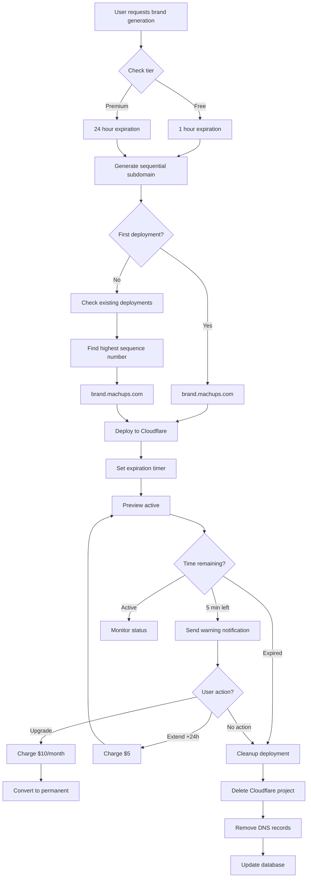

# Preview Deployments - Feature Plan

## Overview

Time-limited preview deployments with tier-based duration and sequential subdomain numbering for brand re-deployments.

**Milestone**: Phase 1, Step 5
**Dependencies**: auto-deploy (deployment infrastructure)
**Branch**: `feature/preview-deployments`
**Version**: v0.3.0-alpha.5
**Estimated Effort**: 2-3 days

---

## Goals

### Primary Goals
- ✅ Free tier: 1 hour preview deployments
- ✅ Premium tier: 24 hour preview deployments
- ✅ Sequential numbering for re-deployments (brand, brand1, brand2, etc.)
- ✅ Automatic expiration and cleanup
- ✅ Extension and upgrade options

### Success Criteria
- [ ] Preview deploys in <90 seconds
- [ ] Expiration accuracy ±30 seconds
- [ ] Cleanup success rate >99%
- [ ] Zero manual intervention required
- [ ] User warned 5 minutes before expiration

---

## Technical Architecture

### Preview Deployment Flow


---

## User Flow

### Free Tier User
```
1. Generate brand → Deploy to brand.machups.com
2. Preview expires after 1 hour
3. Re-generate → Deploy to brand1.machups.com
4. Preview expires after 1 hour
5. Re-generate → Deploy to brand2.machups.com
```

### Premium Tier User
```
1. Generate brand → Deploy to brand.machups.com
2. Preview expires after 24 hours
3. Optional: Extend +24h for $5
4. Optional: Upgrade to permanent for $10/month
```

---

## Implementation Plan

### Phase 1: Database Schema
**File**: `lib/database/schema/preview-deployments.ts`

**Schema**:
```typescript
interface PreviewDeployment {
  id: string;
  userId: string;
  brandId: string;
  brandName: string;
  subdomain: string;           // "hero-analytics"
  sequenceNumber: number;      // 0, 1, 2, 3...
  fullSubdomain: string;       // "hero-analytics" or "hero-analytics1"
  tier: 'free' | 'premium';
  expiresAt: Date;
  createdAt: Date;
  status: 'active' | 'expiring' | 'expired' | 'extended' | 'upgraded';
  cloudflareProjectId: string;
  cloudflareDeploymentId: string;
  notificationsSent: {
    fiveMinuteWarning: boolean;
    expired: boolean;
  };
}

interface PreviewExtension {
  id: string;
  previewId: string;
  userId: string;
  extendedBy: number;          // Hours
  chargeAmount: number;        // USD cents
  chargeId: string;            // Stripe charge ID
  createdAt: Date;
}

interface PreviewUpgrade {
  id: string;
  previewId: string;
  userId: string;
  permanentSubdomain: string;
  monthlyCharge: number;       // USD cents
  subscriptionId: string;      // Stripe subscription ID
  createdAt: Date;
}
```

**Migrations**:
```sql
CREATE TABLE preview_deployments (
  id UUID PRIMARY KEY DEFAULT gen_random_uuid(),
  user_id UUID NOT NULL REFERENCES users(id),
  brand_id UUID NOT NULL REFERENCES brands(id),
  brand_name VARCHAR(255) NOT NULL,
  subdomain VARCHAR(255) NOT NULL,
  sequence_number INT NOT NULL DEFAULT 0,
  full_subdomain VARCHAR(255) NOT NULL UNIQUE,
  tier VARCHAR(20) NOT NULL CHECK (tier IN ('free', 'premium')),
  expires_at TIMESTAMP WITH TIME ZONE NOT NULL,
  created_at TIMESTAMP WITH TIME ZONE NOT NULL DEFAULT NOW(),
  status VARCHAR(20) NOT NULL DEFAULT 'active',
  cloudflare_project_id VARCHAR(255) NOT NULL,
  cloudflare_deployment_id VARCHAR(255) NOT NULL,
  notifications_sent JSONB NOT NULL DEFAULT '{"fiveMinuteWarning": false, "expired": false}',
  INDEX idx_user_subdomain (user_id, subdomain),
  INDEX idx_expires_at (expires_at),
  INDEX idx_status (status)
);

CREATE TABLE preview_extensions (
  id UUID PRIMARY KEY DEFAULT gen_random_uuid(),
  preview_id UUID NOT NULL REFERENCES preview_deployments(id),
  user_id UUID NOT NULL REFERENCES users(id),
  extended_by INT NOT NULL,
  charge_amount INT NOT NULL,
  charge_id VARCHAR(255) NOT NULL,
  created_at TIMESTAMP WITH TIME ZONE NOT NULL DEFAULT NOW()
);

CREATE TABLE preview_upgrades (
  id UUID PRIMARY KEY DEFAULT gen_random_uuid(),
  preview_id UUID NOT NULL REFERENCES preview_deployments(id),
  user_id UUID NOT NULL REFERENCES users(id),
  permanent_subdomain VARCHAR(255) NOT NULL UNIQUE,
  monthly_charge INT NOT NULL,
  subscription_id VARCHAR(255) NOT NULL,
  created_at TIMESTAMP WITH TIME ZONE NOT NULL DEFAULT NOW()
);
```

---

### Phase 2: Sequential Subdomain Generator
**File**: `lib/preview/subdomain-sequencer.ts`

**Functions to implement**:
```typescript
export async function generatePreviewSubdomain(
  userId: string,
  brandName: string
): Promise<{ subdomain: string; sequenceNumber: number }> {
  const baseSubdomain = normalizeBrandName(brandName);

  // Find all existing deployments for this user + base subdomain
  const existingDeployments = await db.previewDeployments.findMany({
    where: {
      userId,
      subdomain: baseSubdomain
    },
    orderBy: {
      sequenceNumber: 'desc'
    }
  });

  if (existingDeployments.length === 0) {
    // First deployment - no number suffix
    return {
      subdomain: baseSubdomain,
      sequenceNumber: 0
    };
  }

  // Get highest sequence number
  const highestSequence = existingDeployments[0].sequenceNumber;
  const nextSequence = highestSequence + 1;

  return {
    subdomain: `${baseSubdomain}${nextSequence}`,
    sequenceNumber: nextSequence
  };
}

export function normalizeBrandName(brandName: string): string {
  return brandName
    .toLowerCase()
    .replace(/[^a-z0-9]+/g, '-')  // Replace non-alphanumeric with dash
    .replace(/^-+|-+$/g, '')       // Trim dashes from start/end
    .substring(0, 63);             // DNS subdomain limit
}

export async function isSubdomainAvailable(
  subdomain: string
): Promise<boolean> {
  const existing = await db.previewDeployments.findFirst({
    where: {
      fullSubdomain: subdomain,
      status: { in: ['active', 'expiring'] }
    }
  });

  return !existing;
}
```

**Unit Tests**:
- First deployment gets sequence 0 (no suffix)
- Subsequent deployments increment correctly
- Subdomain normalization handles special characters
- Availability check works

---

### Phase 3: Expiration Management
**File**: `lib/preview/expiration-manager.ts`

**Functions to implement**:
```typescript
export async function scheduleExpiration(
  previewId: string,
  tier: 'free' | 'premium'
): Promise<void> {
  const duration = tier === 'free' ? 1 : 24; // hours
  const expiresAt = new Date(Date.now() + duration * 60 * 60 * 1000);

  await db.previewDeployments.update({
    where: { id: previewId },
    data: { expiresAt }
  });
}

export async function checkExpiringPreviews(): Promise<void> {
  const now = new Date();
  const fiveMinutesFromNow = new Date(now.getTime() + 5 * 60 * 1000);

  // Find previews expiring in 5 minutes
  const expiringSoon = await db.previewDeployments.findMany({
    where: {
      status: 'active',
      expiresAt: {
        gte: now,
        lte: fiveMinutesFromNow
      },
      notificationsSent: {
        path: ['fiveMinuteWarning'],
        equals: false
      }
    }
  });

  // Send warning notifications
  for (const preview of expiringSoon) {
    await sendExpirationWarning(preview);
    await db.previewDeployments.update({
      where: { id: preview.id },
      data: {
        status: 'expiring',
        notificationsSent: {
          ...preview.notificationsSent,
          fiveMinuteWarning: true
        }
      }
    });
  }
}

export async function cleanupExpiredPreviews(): Promise<void> {
  const now = new Date();

  // Find expired previews
  const expired = await db.previewDeployments.findMany({
    where: {
      expiresAt: { lte: now },
      status: { in: ['active', 'expiring'] }
    }
  });

  for (const preview of expired) {
    try {
      // Delete Cloudflare Pages project
      await cloudflareDeployer.deleteProject(preview.cloudflareProjectId);

      // Remove DNS records
      await cloudflareDeployer.deleteDNSRecord(preview.fullSubdomain);

      // Update database
      await db.previewDeployments.update({
        where: { id: preview.id },
        data: { status: 'expired' }
      });

      // Send expiration notification
      await sendExpirationNotification(preview);

    } catch (error) {
      console.error(`Failed to cleanup preview ${preview.id}:`, error);
      // Don't throw - continue with other cleanups
    }
  }
}
```

**Unit Tests**:
- Expiration schedules correctly for both tiers
- Warning sent at 5 minutes
- Cleanup removes all resources
- Error in one cleanup doesn't block others

---

### Phase 4: Cron Job
**File**: `app/api/cron/cleanup-previews/route.ts`

**Implementation**:
```typescript
import { NextRequest, NextResponse } from 'next/server';
import { checkExpiringPreviews, cleanupExpiredPreviews } from '@/lib/preview/expiration-manager';

export const runtime = 'edge';

export async function GET(request: NextRequest) {
  // Verify cron secret
  const authHeader = request.headers.get('authorization');
  if (authHeader !== `Bearer ${process.env.CRON_SECRET}`) {
    return NextResponse.json({ error: 'Unauthorized' }, { status: 401 });
  }

  try {
    // Check for expiring previews (5 min warning)
    await checkExpiringPreviews();

    // Cleanup expired previews
    await cleanupExpiredPreviews();

    return NextResponse.json({
      success: true,
      timestamp: new Date().toISOString()
    });
  } catch (error) {
    console.error('Cron job failed:', error);
    return NextResponse.json(
      { error: 'Cleanup failed', details: error instanceof Error ? error.message : 'Unknown' },
      { status: 500 }
    );
  }
}
```

**Vercel Cron Configuration** (`vercel.json`):
```json
{
  "crons": [
    {
      "path": "/api/cron/cleanup-previews",
      "schedule": "*/5 * * * *"
    }
  ]
}
```

**Integration Tests**:
- Cron authenticates with secret
- Warnings sent correctly
- Cleanups execute properly
- Errors are logged but don't fail job

---

### Phase 5: Extension & Upgrade
**File**: `lib/preview/extension.ts`

**Functions to implement**:
```typescript
export async function extendPreview(
  previewId: string,
  userId: string
): Promise<PreviewExtension> {
  const preview = await db.previewDeployments.findFirst({
    where: { id: previewId, userId }
  });

  if (!preview) {
    throw new Error('Preview not found');
  }

  if (preview.status === 'expired') {
    throw new Error('Cannot extend expired preview');
  }

  // Charge $5 for 24 hour extension
  const charge = await stripeClient.charges.create({
    amount: 500, // $5.00 in cents
    currency: 'usd',
    customer: userId,
    description: `24-hour preview extension for ${preview.fullSubdomain}`
  });

  // Extend expiration by 24 hours
  const newExpiresAt = new Date(preview.expiresAt.getTime() + 24 * 60 * 60 * 1000);

  await db.previewDeployments.update({
    where: { id: previewId },
    data: {
      expiresAt: newExpiresAt,
      status: 'extended'
    }
  });

  // Record extension
  const extension = await db.previewExtensions.create({
    data: {
      previewId,
      userId,
      extendedBy: 24,
      chargeAmount: 500,
      chargeId: charge.id
    }
  });

  return extension;
}

export async function upgradeToPermanen(
  previewId: string,
  userId: string
): Promise<PreviewUpgrade> {
  const preview = await db.previewDeployments.findFirst({
    where: { id: previewId, userId }
  });

  if (!preview) {
    throw new Error('Preview not found');
  }

  // Create $10/month subscription
  const subscription = await stripeClient.subscriptions.create({
    customer: userId,
    items: [{ price: process.env.STRIPE_PERMANENT_DEPLOYMENT_PRICE_ID }],
    metadata: {
      previewId,
      subdomain: preview.fullSubdomain
    }
  });

  // Update deployment to permanent
  await db.previewDeployments.update({
    where: { id: previewId },
    data: {
      status: 'upgraded',
      expiresAt: new Date('2099-12-31') // Far future date = permanent
    }
  });

  // Record upgrade
  const upgrade = await db.previewUpgrades.create({
    data: {
      previewId,
      userId,
      permanentSubdomain: preview.fullSubdomain,
      monthlyCharge: 1000,
      subscriptionId: subscription.id
    }
  });

  return upgrade;
}
```

**Integration Tests**:
- Extension charges correctly
- Expiration extends by 24 hours
- Upgrade creates subscription
- Permanent deployments don't expire

---

### Phase 6: API Routes
**Files**:
- `app/api/preview/create/route.ts`
- `app/api/preview/extend/route.ts`
- `app/api/preview/upgrade/route.ts`
- `app/api/preview/status/[id]/route.ts`

**Endpoints**:

#### POST `/api/preview/create`
```typescript
Request: {
  brandId: string;
  brandName: string;
  tier: 'free' | 'premium';
}

Response: {
  id: string;
  subdomain: string;
  url: string;
  expiresAt: string;
  sequenceNumber: number;
}
```

#### POST `/api/preview/extend`
```typescript
Request: {
  previewId: string;
}

Response: {
  newExpiresAt: string;
  chargeId: string;
  amount: number;
}
```

#### POST `/api/preview/upgrade`
```typescript
Request: {
  previewId: string;
}

Response: {
  subscriptionId: string;
  permanentSubdomain: string;
  monthlyCharge: number;
}
```

---

## Deliverables

### Code
- [ ] `lib/database/schema/preview-deployments.ts` - Database schema
- [ ] `lib/preview/subdomain-sequencer.ts` - Sequential numbering logic
- [ ] `lib/preview/expiration-manager.ts` - Expiration and cleanup
- [ ] `lib/preview/extension.ts` - Extension and upgrade logic
- [ ] `app/api/preview/create/route.ts` - Create preview API
- [ ] `app/api/preview/extend/route.ts` - Extend preview API
- [ ] `app/api/preview/upgrade/route.ts` - Upgrade to permanent API
- [ ] `app/api/preview/status/[id]/route.ts` - Status check API
- [ ] `app/api/cron/cleanup-previews/route.ts` - Cron cleanup job

### UI Components
- [ ] `components/preview/PreviewTimer.tsx` - Countdown timer
- [ ] `components/preview/ExtendModal.tsx` - Extension modal
- [ ] `components/preview/UpgradeModal.tsx` - Upgrade modal
- [ ] `components/preview/ExpirationWarning.tsx` - Warning banner

### Tests
- [ ] `lib/preview/subdomain-sequencer.test.ts` - Sequencing tests
- [ ] `lib/preview/expiration-manager.test.ts` - Expiration tests
- [ ] `lib/preview/extension.test.ts` - Extension/upgrade tests
- [ ] `tests/integration/preview-lifecycle.test.ts` - Full lifecycle test

### Documentation
- [ ] `docs/guides/PREVIEW_DEPLOYMENTS.md` - User guide
- [ ] `docs/api/PREVIEW_API.md` - API documentation

---

## Success Metrics

### Performance Metrics
- **Preview creation**: <90 seconds (same as auto-deploy)
- **Expiration accuracy**: ±30 seconds
- **Cleanup time**: <5 seconds per preview
- **Cron job execution**: <30 seconds total

### Reliability Metrics
- **Cleanup success rate**: >99%
- **Warning delivery**: >98%
- **Extension success rate**: >99.5%
- **Zero manual interventions**: 100%

### Business Metrics
- **Extension conversion rate**: Target >15%
- **Upgrade conversion rate**: Target >5%
- **Average preview duration (free)**: ~45 minutes
- **Average preview duration (premium)**: ~18 hours

---

## Dependencies

### External Services
- **Stripe** - Payment processing
- **Cloudflare Pages API** - Deployment management
- **Vercel Cron** - Scheduled job execution

### Internal Dependencies
- `lib/deployment/auto-deploy.ts` - Deployment infrastructure
- `lib/deployment/cloudflare-deployer.ts` - Cloudflare API client

---

## Timeline

| Phase | Duration | Deliverables |
|-------|----------|--------------|
| **Phase 1**: Database Schema | 0.25 day | Schema + migrations |
| **Phase 2**: Subdomain Sequencer | 0.5 day | subdomain-sequencer.ts + tests |
| **Phase 3**: Expiration Manager | 0.75 day | expiration-manager.ts + tests |
| **Phase 4**: Cron Job | 0.25 day | Cron route + config |
| **Phase 5**: Extension/Upgrade | 0.75 day | extension.ts + tests |
| **Phase 6**: API Routes | 0.5 day | API endpoints |
| **UI Components** | 0.5 day | Timer, modals, warnings |
| **Integration & Testing** | 0.5 day | E2E tests, bug fixes |

**Total**: 2-3 days

---

## Risks and Mitigations

### Risk 1: Cron job fails silently
**Mitigation**: Add monitoring, error alerts, health checks

### Risk 2: Cloudflare cleanup fails
**Mitigation**: Retry logic, manual cleanup dashboard, error tracking

### Risk 3: User extends at last second (race condition)
**Mitigation**: Grace period (don't cleanup until 1 minute after expiration)

### Risk 4: Stripe webhook delays
**Mitigation**: Poll Stripe status, optimistic UI updates

---

## Merge Checklist

Before merging `feature/preview-deployments` → `develop`:

- [ ] All unit tests pass
- [ ] Integration tests pass
- [ ] Cron job tested locally
- [ ] Stripe integration tested (test mode)
- [ ] Sequential numbering works correctly
- [ ] Cleanup removes all resources
- [ ] TypeScript compiles without errors
- [ ] No merge conflicts with develop
- [ ] Code review approved

**Merge Order Position**: Step 5 of 7 (Phase 1)
**Version Tag**: `v0.3.0-alpha.5`
**Previous Step**: feature/design-tokens (v0.3.0-alpha.4)
**Next Step**: Integration testing on develop

---

**Status**: Design Complete ✅
**Implementation**: Not Started
**Documentation**: Complete
**Testing**: Not Started
