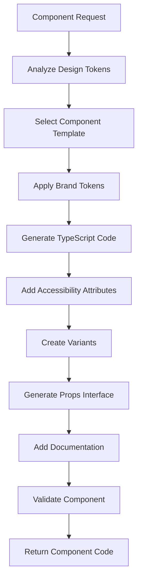

# Component Generator - Feature Plan

## Overview

AI-powered React component generation system that creates production-ready components with design tokens, accessibility, and best practices built-in.

**Milestone**: Phase 2, Step 1
**Dependencies**: design-tokens (Phase 1, Step 4)
**Branch**: `feature/component-generator`
**Version**: v0.4.0-alpha.1
**Estimated Effort**: 3-4 days

---

## Goals

### Primary Goals
- ✅ Generate production-ready React components
- ✅ Apply brand design tokens automatically
- ✅ WCAG AA accessibility compliance
- ✅ TypeScript support with full types
- ✅ Responsive design out-of-the-box

### Success Criteria
- [ ] Components pass WCAG AA validation
- [ ] 100% TypeScript type coverage
- [ ] All components responsive (mobile/tablet/desktop)
- [ ] Design tokens properly applied
- [ ] Zero runtime errors

---

## Component Categories

### 1. Layout Components
- Container
- Grid
- Stack (Vertical/Horizontal)
- Section
- Divider

### 2. Typography Components
- Heading (H1-H6)
- Text (Body, Caption, Label)
- Link
- Blockquote
- Code Block

### 3. Form Components
- Input (Text, Email, Password, Number)
- Textarea
- Select/Dropdown
- Checkbox
- Radio Group
- Switch/Toggle
- File Upload
- Date Picker

### 4. Interactive Components
- Button (Primary, Secondary, Outline, Ghost, Link)
- Icon Button
- Button Group
- Dropdown Menu
- Modal/Dialog
- Toast/Notification
- Tooltip
- Popover

### 5. Data Display Components
- Card
- Badge
- Avatar
- Table
- List (Ordered/Unordered/Description)
- Stat/Metric
- Progress Bar
- Skeleton Loader

### 6. Navigation Components
- Navbar
- Sidebar
- Breadcrumbs
- Tabs
- Pagination
- Footer

---

## Technical Architecture

### Component Generation Pipeline



---

## Implementation Plan

### Phase 1: Component Templates
**File**: `lib/components/templates/`

**Template Structure**:
```typescript
interface ComponentTemplate {
  name: string;
  category: 'layout' | 'typography' | 'form' | 'interactive' | 'data' | 'navigation';
  baseCode: string;
  requiredTokens: string[];
  variants: Record<string, VariantConfig>;
  accessibility: AccessibilityConfig;
}

interface VariantConfig {
  name: string;
  className: string;
  description: string;
}

interface AccessibilityConfig {
  role?: string;
  ariaAttributes: string[];
  keyboardNav?: {
    keys: string[];
    actions: Record<string, string>;
  };
  focusManagement: boolean;
}
```

**Example Template** (Button):
```typescript
export const ButtonTemplate: ComponentTemplate = {
  name: 'Button',
  category: 'interactive',
  baseCode: `
export interface ButtonProps extends React.ButtonHTMLAttributes<HTMLButtonElement> {
  variant?: 'primary' | 'secondary' | 'outline' | 'ghost';
  size?: 'sm' | 'md' | 'lg';
  loading?: boolean;
  leftIcon?: React.ReactNode;
  rightIcon?: React.ReactNode;
}

export const Button = React.forwardRef<HTMLButtonElement, ButtonProps>(
  ({ variant = 'primary', size = 'md', loading, leftIcon, rightIcon, children, disabled, ...props }, ref) => {
    return (
      <button
        ref={ref}
        disabled={disabled || loading}
        className={cn(
          baseStyles,
          variants[variant],
          sizes[size],
          loading && loadingStyles,
          disabled && disabledStyles
        )}
        {...props}
      >
        {loading && <Spinner className="mr-2" size={size} />}
        {!loading && leftIcon && <span className="mr-2">{leftIcon}</span>}
        {children}
        {rightIcon && <span className="ml-2">{rightIcon}</span>}
      </button>
    );
  }
);

Button.displayName = 'Button';
  `,
  requiredTokens: ['colors.primary', 'colors.secondary', 'spacing', 'borderRadius', 'fontSize'],
  variants: {
    primary: { name: 'Primary', className: 'bg-primary-600 hover:bg-primary-700 text-white', description: 'Main call-to-action' },
    secondary: { name: 'Secondary', className: 'bg-secondary-600 hover:bg-secondary-700 text-white', description: 'Secondary actions' },
    outline: { name: 'Outline', className: 'border-2 border-primary-600 text-primary-600 hover:bg-primary-50', description: 'Subtle emphasis' },
    ghost: { name: 'Ghost', className: 'text-primary-600 hover:bg-primary-50', description: 'Minimal emphasis' }
  },
  accessibility: {
    role: 'button',
    ariaAttributes: ['aria-label', 'aria-disabled', 'aria-busy'],
    keyboardNav: {
      keys: ['Enter', 'Space'],
      actions: { Enter: 'click', Space: 'click' }
    },
    focusManagement: true
  }
};
```

---

### Phase 2: Token Application Engine
**File**: `lib/components/token-applier.ts`

**Functions**:
```typescript
export function applyDesignTokens(
  componentCode: string,
  tokens: DesignTokens
): string {
  // Replace token placeholders with actual values
  let processed = componentCode;

  // Apply color tokens
  processed = processed.replace(/\{colors\.(\w+)\.(\d+)\}/g, (_, color, shade) => {
    return tokens.colors[color]?.[shade] || `var(--${color}-${shade})`;
  });

  // Apply spacing tokens
  processed = processed.replace(/\{spacing\.(\w+)\}/g, (_, key) => {
    return tokens.spacing[key] || `var(--spacing-${key})`;
  });

  // Apply typography tokens
  processed = processed.replace(/\{fontSize\.(\w+)\}/g, (_, key) => {
    return tokens.typography.fontSize[key] || `var(--fontSize-${key})`;
  });

  return processed;
}

export function generateVariantStyles(
  variants: Record<string, VariantConfig>,
  tokens: DesignTokens
): string {
  return Object.entries(variants)
    .map(([key, config]) => {
      return `${key}: '${applyTokensToClassName(config.className, tokens)}'`;
    })
    .join(',\n  ');
}
```

---

### Phase 3: Accessibility Validator
**File**: `lib/components/accessibility-validator.ts`

**Functions**:
```typescript
export interface A11yValidationResult {
  valid: boolean;
  errors: A11yError[];
  warnings: A11yWarning[];
  score: number; // 0-100
}

export function validateAccessibility(
  componentCode: string,
  componentType: string
): A11yValidationResult {
  const errors: A11yError[] = [];
  const warnings: A11yWarning[] = [];

  // Check for semantic HTML
  if (!hasSemantic HTML(componentCode, componentType)) {
    errors.push({
      code: 'MISSING_SEMANTIC_HTML',
      message: `${componentType} should use semantic HTML elements`,
      severity: 'error'
    });
  }

  // Check for ARIA attributes
  if (requiresARIA(componentType) && !hasARIAAttributes(componentCode)) {
    errors.push({
      code: 'MISSING_ARIA',
      message: `${componentType} requires ARIA attributes for accessibility`,
      severity: 'error'
    });
  }

  // Check for keyboard navigation
  if (isInteractive(componentType) && !hasKeyboardSupport(componentCode)) {
    errors.push({
      code: 'MISSING_KEYBOARD_NAV',
      message: `${componentType} must support keyboard navigation`,
      severity: 'error'
    });
  }

  // Check for focus management
  if (!hasFocusManagement(componentCode, componentType)) {
    warnings.push({
      code: 'NO_FOCUS_MANAGEMENT',
      message: 'Consider adding focus management for better UX',
      severity: 'warning'
    });
  }

  // Calculate score
  const totalChecks = errors.length + warnings.length + 10; // Assume 10 base checks
  const passedChecks = totalChecks - errors.length - (warnings.length * 0.5);
  const score = Math.round((passedChecks / totalChecks) * 100);

  return {
    valid: errors.length === 0,
    errors,
    warnings,
    score
  };
}
```

---

### Phase 4: Component Generator
**File**: `lib/components/generator.ts`

**Main Function**:
```typescript
export async function generateComponent(
  componentName: string,
  options: ComponentGenerationOptions
): Promise<GeneratedComponent> {
  // 1. Load component template
  const template = loadTemplate(componentName);

  // 2. Apply design tokens
  const withTokens = applyDesignTokens(template.baseCode, options.tokens);

  // 3. Generate variants
  const variantStyles = generateVariantStyles(template.variants, options.tokens);

  // 4. Add accessibility features
  const withA11y = addAccessibilityFeatures(withTokens, template.accessibility);

  // 5. Validate component
  const validation = validateAccessibility(withA11y, componentName);
  if (!validation.valid) {
    throw new Error(`Component failed accessibility validation: ${validation.errors.map(e => e.message).join(', ')}`);
  }

  // 6. Generate documentation
  const docs = generateComponentDocs(componentName, template, options);

  return {
    name: componentName,
    code: withA11y,
    variants: template.variants,
    props: extractPropsInterface(withA11y),
    documentation: docs,
    accessibility: validation,
    examples: generateExamples(componentName, template)
  };
}
```

---

## Deliverables

### Code
- [ ] `lib/components/templates/` - Component templates library
- [ ] `lib/components/token-applier.ts` - Token application engine
- [ ] `lib/components/accessibility-validator.ts` - A11y validation
- [ ] `lib/components/generator.ts` - Main generator
- [ ] `lib/components/types.ts` - Type definitions
- [ ] `app/api/components/generate/route.ts` - Generation API
- [ ] `app/api/components/validate/route.ts` - Validation API

### Component Templates (30+ templates)
- [ ] Layout: Container, Grid, Stack, Section, Divider
- [ ] Typography: Heading, Text, Link, Blockquote, Code
- [ ] Forms: Input, Textarea, Select, Checkbox, Radio, Switch
- [ ] Interactive: Button, IconButton, Dropdown, Modal, Toast
- [ ] Data: Card, Badge, Avatar, Table, List, Progress
- [ ] Navigation: Navbar, Sidebar, Breadcrumbs, Tabs, Pagination

### Tests
- [ ] `lib/components/generator.test.ts` - Generator tests
- [ ] `lib/components/accessibility-validator.test.ts` - A11y tests
- [ ] `tests/integration/component-generation.test.ts` - E2E tests

### Documentation
- [ ] `docs/guides/COMPONENT_GENERATION_GUIDE.md` - User guide
- [ ] `docs/api/COMPONENTS_API.md` - API documentation
- [ ] Generated component docs (part of output)

---

## Success Metrics

### Quality Metrics
- **Accessibility score**: >95/100 (WCAG AA)
- **TypeScript coverage**: 100%
- **Component test coverage**: >90%
- **Zero accessibility errors**: 100%

### Performance Metrics
- **Component generation**: <5 seconds
- **Token application**: <100ms
- **Validation**: <500ms

### User Metrics
- **Component quality rating**: >4.5/5
- **Adoption rate**: >80% use generated components
- **Customization rate**: <20% modify generated code

---

## Merge Checklist

Before merging `feature/component-generator` → `develop`:

- [ ] All unit tests pass
- [ ] All 30+ component templates created
- [ ] Accessibility validation passes
- [ ] TypeScript compiles without errors
- [ ] Integration tests pass
- [ ] Documentation complete
- [ ] No merge conflicts with develop
- [ ] Code review approved

**Merge Order Position**: Step 1 of 5 (Phase 2)
**Version Tag**: `v0.4.0-alpha.1`
**Previous Phase**: Phase 1 complete (v0.3.0)
**Next Step**: feature/shadcn-integration (v0.4.0-alpha.2)

---

**Status**: Design Complete ✅
**Implementation**: Scheduled for Dec 12, 2025
**Documentation**: Complete
**Testing**: Not Started
