# MACHUPS Workflow Diagrams
## User, Admin, and Application Flows

---

## User Workflows

### 1. Brand Generation Flow (Standard)

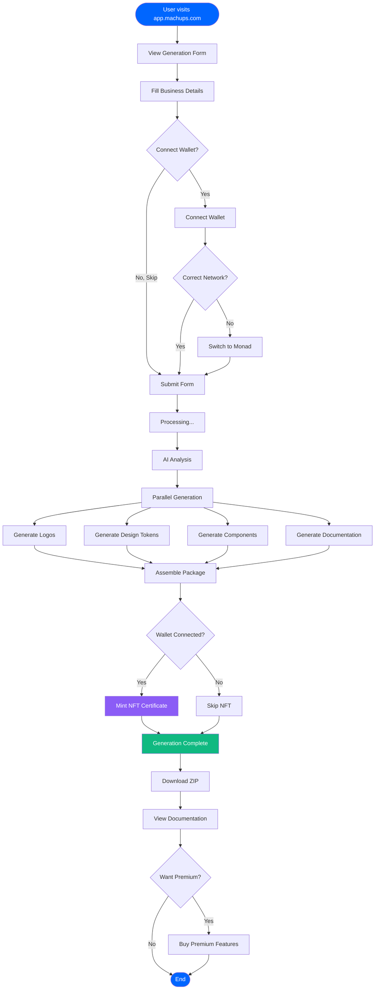

### 2. Premium Feature Purchase Flow

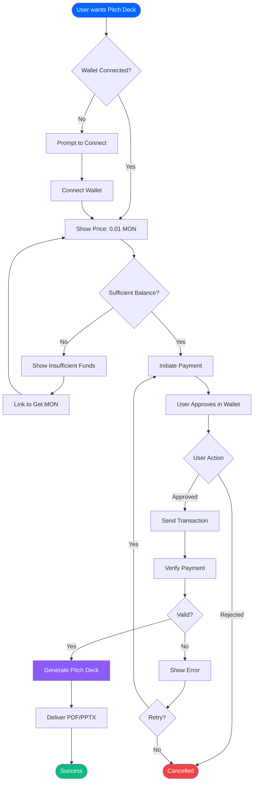

### 3. NFT Certificate Claiming Flow

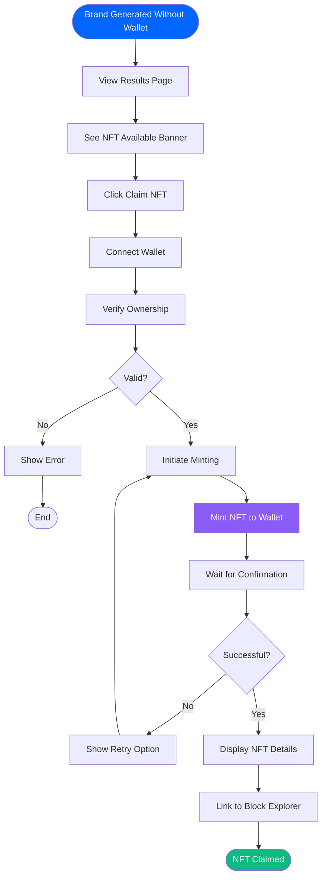

---

## Admin Workflows

### 4. Contract Deployment Flow

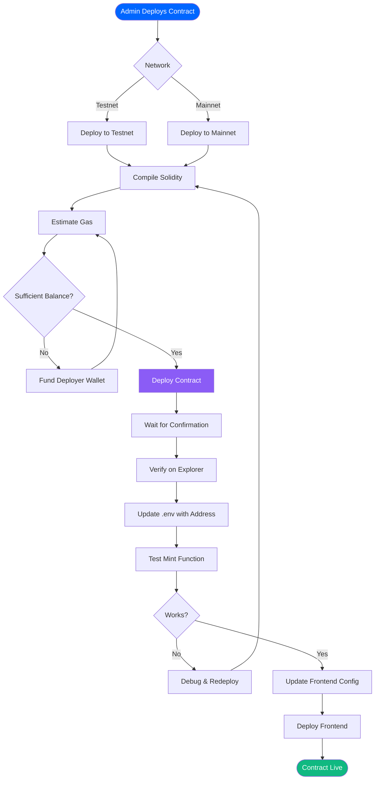

### 5. Monitoring & Analytics Flow

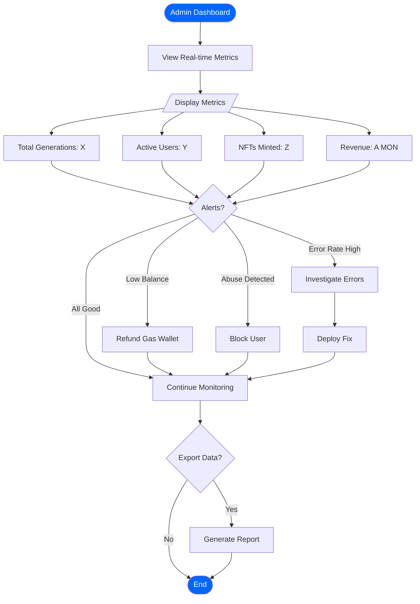

---

## Application Flows

### 6. Brand Generation Pipeline (Internal)

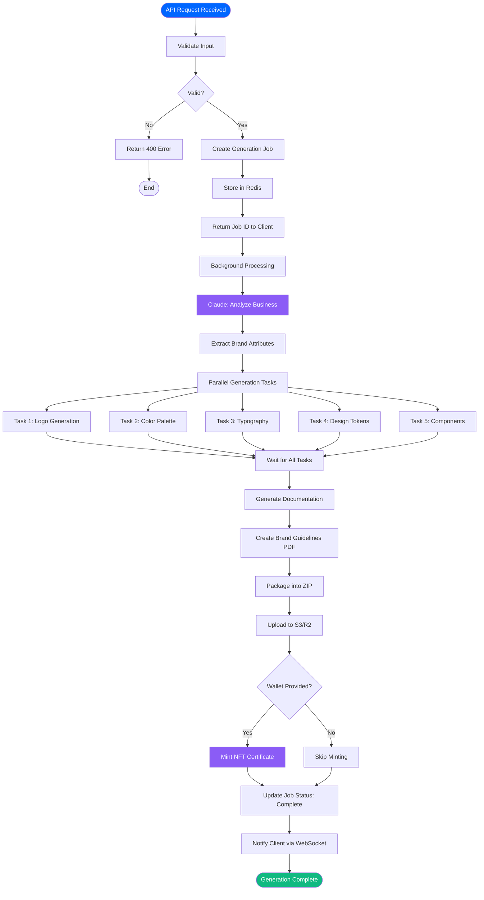

### 7. Real-time Progress Updates (WebSocket)

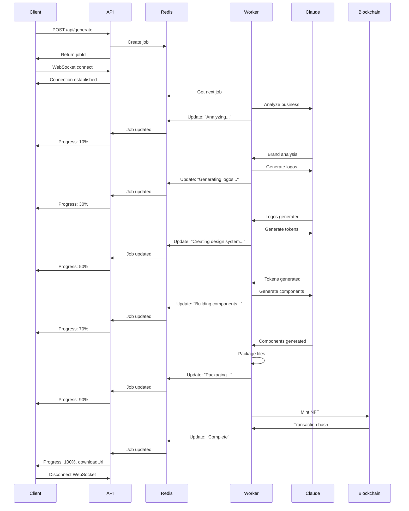

### 8. Error Handling & Retry Logic

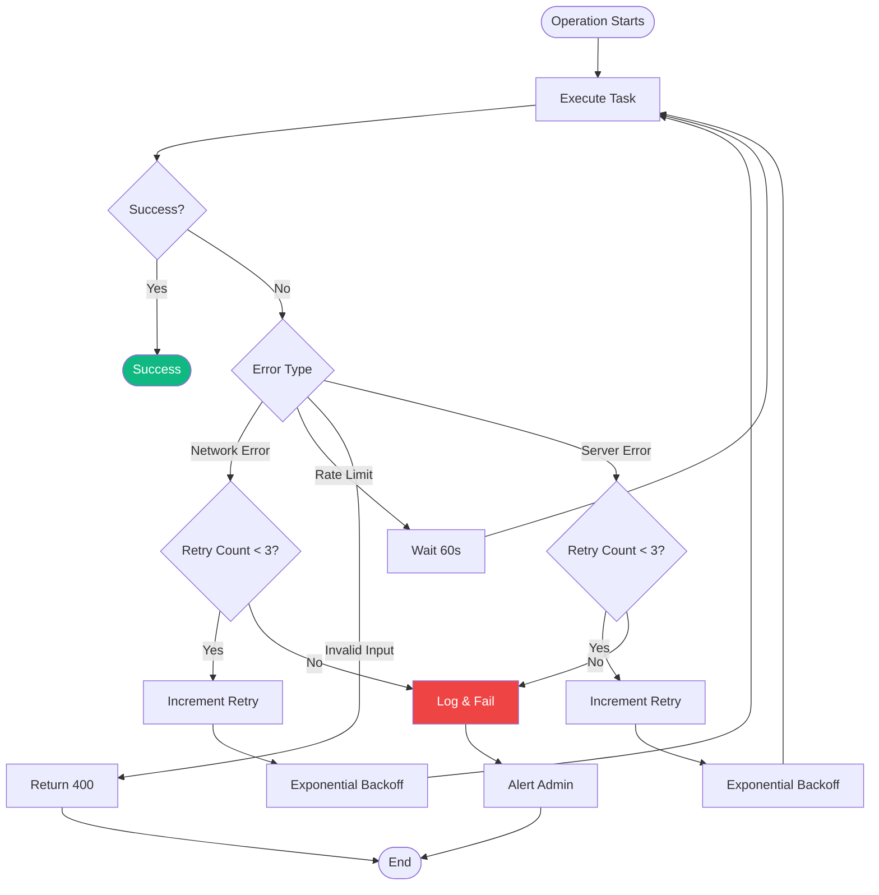

---

## Deployment Workflows

### 9. CI/CD Pipeline

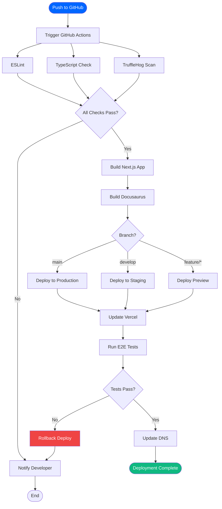

### 10. Multi-Site Deployment

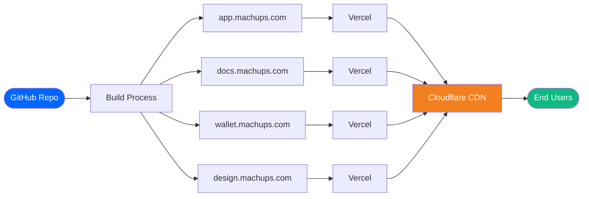

---

## Data Flow Diagrams

### 11. Design Token Flow

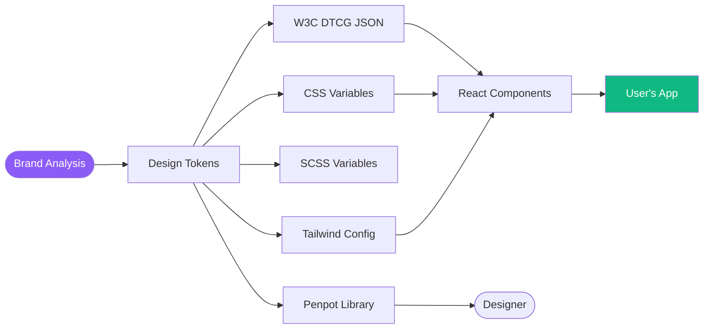

### 12. NFT Metadata Flow

```mermaid
flowchart TD
    Brand([Brand Generated]) --> Metadata[Create Metadata]

    Metadata --> MetadataJSON{
        name: Brand Name
        description: ...
        image: ipfs://...
        attributes: [...]
    }

    MetadataJSON --> UploadIPFS[Upload to IPFS]
    UploadIPFS --> IPFSHash[IPFS Hash]

    IPFSHash --> SmartContract[NFT Contract]
    SmartContract --> MintFunction[mintBrandCertificate]

    MintFunction --> Blockchain[Monad Blockchain]
    Blockchain --> TokenID[Token ID]

    TokenID --> UserWallet[User's Wallet]
    TokenID --> Explorer[Block Explorer]

    style Brand fill:#8B5CF6,color:#fff
    style Blockchain fill:#0066FF,color:#fff
    style UserWallet fill:#10B981,color:#fff
```

---

**Total Diagrams:** 12
**Coverage:**
- User Flows: 3
- Admin Flows: 2
- Application Flows: 4
- Deployment Flows: 2
- Data Flows: 2

**Last Updated:** December 5, 2025
**Event:** Monad Blitz SF #18
