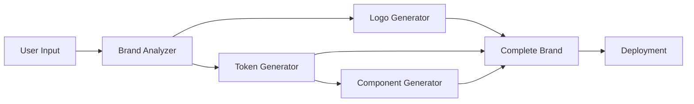

# Phase 2: Core Engine Development

**Status:** 🚀 Ready to Begin
**Duration:** 3-4 hours
**Target:** Hours 1-5 from event timeline
**Version:** 1.0

---

## 📊 Current Status

### Phase 1 Complete ✅

We've built the complete infrastructure:

| Component | Status | Details |
|-----------|--------|---------|
| Brand Orchestrator | ✅ Complete | Coordinates entire generation pipeline |
| Penpot MCP Integration | ✅ Complete | Automated mockup generation |
| Deployment System | ✅ Complete | Subdomain preview deployments |
| Template System | ✅ Complete | Instant brand variations |
| Git Workflow | ✅ Complete | 28-branch strategy defined |
| Demo Brand | ✅ Complete | Gonads.io enterprise package |
| Documentation | ✅ Complete | 50+ pages of guides |
| CI/CD | ✅ Complete | GitHub Actions workflows |

**Key Metrics:**
- 💰 Cost Reduction: 81% vs traditional
- ⚡ Time Reduction: 95% vs traditional
- 🎨 Quality: Enterprise-grade output

---

## 🎯 Phase 2 Objectives

Build the **actual AI-powered generators** that create brands in under 3 minutes.

### What We're Building



### The 4 Core Generators

#### 1. Brand Analyzer
- **Purpose:** Strategic brand analysis using Claude AI
- **Output:** Name, tagline, colors, typography, personality
- **Time:** 30 seconds
- **Tech:** Claude Sonnet 4.5

#### 2. Logo Generator
- **Purpose:** Generate 3 logo variations
- **Output:** Wordmark, Icon, Combination (SVG + PNG)
- **Time:** 45 seconds
- **Tech:** HTML/CSS → SVG/PNG export

#### 3. Token Generator
- **Purpose:** W3C DTCG design tokens
- **Output:** Colors, typography, spacing, radius, shadows
- **Time:** 15 seconds
- **Tech:** JSON schema validation, WCAG compliance

#### 4. Component Generator
- **Purpose:** 30+ production-ready React components
- **Output:** TypeScript components with full accessibility
- **Time:** 60 seconds
- **Tech:** Template-based generation, Framer Motion

---

## 🌿 Implementation Plan

### Branch Structure

```
phase-2-core-engine
├── feature/brand-analyzer
├── feature/logo-generator
├── feature/token-generator
├── feature/component-generator
└── feature/integration-pipeline
```

### Development Timeline

| Hour | Focus | Deliverables |
|------|-------|--------------|
| 1 | Setup & Analyzer | Brand analyzer working |
| 2 | Logo Generation | 3 logo variants exporting |
| 3 | Design Tokens | W3C DTCG tokens + exports |
| 4 | Components | 30+ React components |
| 5 | Integration | Full pipeline working |

---

## 📋 Feature Details

### Feature 1: Brand Analyzer

**Branch:** `feature/brand-analyzer`

**Files:**
- `lib/generators/brand-analyzer.ts`
- `prompts/brand-strategy.md`
- `types/brand-analysis.ts`

**Key Function:**
```typescript
async function analyzeBrand(input: BrandInput): Promise<BrandAnalysis> {
  // Claude AI strategic analysis
  return {
    name: string;
    tagline: string;
    colors: {
      primary: string;
      secondary: string;
      accent: string;
      neutrals: string[];
    };
    typography: {
      heading: string;
      body: string;
    };
    personality: string[];
    targetAudience: string;
    messaging: string[];
  };
}
```

**Tests:**
- Unit tests for analysis logic
- Integration tests with Claude API
- WCAG color contrast validation

---

### Feature 2: Logo Generator

**Branch:** `feature/logo-generator`

**Files:**
- `lib/generators/logo-generator.ts`
- `lib/generators/logo-templates.ts`
- `lib/utils/html-to-image.ts`

**Logo Types:**

1. **Wordmark Logo**
   - Text-only design
   - Custom typography
   - Gradient effects

2. **Icon Logo**
   - Graphic symbol
   - Geometric shapes
   - Brand colors

3. **Combination Logo**
   - Icon + text together
   - Flexible layouts
   - Multiple orientations

**Export Formats:**
- SVG (vector, infinite scalability)
- PNG 2x (retina display)
- PNG 3x (ultra-high DPI)
- WebP (optimized web format)

---

### Feature 3: Token Generator

**Branch:** `feature/token-generator`

**Files:**
- `lib/generators/token-generator.ts`
- `lib/exporters/token-exporters.ts`
- `lib/validators/wcag-validator.ts`

**Token Categories:**

```json
{
  "$schema": "https://design-tokens.org/schema/version/1.0.0",
  "color": {
    "brand": {
      "primary": { "$value": "#0066FF", "$type": "color" },
      "secondary": { "$value": "#9333EA", "$type": "color" }
    },
    "semantic": {
      "success": { "$value": "#10B981", "$type": "color" },
      "error": { "$value": "#EF4444", "$type": "color" }
    }
  },
  "typography": {
    "fontFamily": {
      "heading": { "$value": "Inter", "$type": "fontFamily" },
      "body": { "$value": "Inter", "$type": "fontFamily" }
    }
  },
  "spacing": {
    "md": { "$value": "1rem", "$type": "dimension" }
  }
}
```

**Export Formats:**
- JSON (W3C DTCG standard)
- CSS Variables (`--color-brand-primary: #0066FF`)
- SCSS Variables (`$color-brand-primary: #0066FF`)
- Tailwind Config (`colors: { brand: { primary: '#0066FF' } }`)

**Validation:**
- WCAG AA color contrast (minimum 4.5:1)
- Font size accessibility
- Touch target sizes (minimum 44x44px)

---

### Feature 4: Component Generator

**Branch:** `feature/component-generator`

**Files:**
- `lib/generators/component-generator.ts`
- `lib/templates/component-templates.ts`
- `lib/utils/tsx-builder.ts`

**Component Library (30+ components):**

**Atoms (10):**
- Button, Input, Label, Badge, Avatar, Icon, Spinner, Divider, Checkbox, Radio

**Molecules (10):**
- InputGroup, Select, TextArea, Toggle, Slider, Tooltip, Alert, Toast, Progress, Tag

**Organisms (10):**
- Card, Modal, Drawer, Dropdown, Navbar, Sidebar, Footer, Hero, Form, Table

**Features:**
- ✅ TypeScript definitions
- ✅ ARIA labels and roles
- ✅ Keyboard navigation
- ✅ Focus management
- ✅ Responsive design
- ✅ Dark mode support
- ✅ Framer Motion animations
- ✅ `prefers-reduced-motion` support

**Example Component:**
```tsx
import { FC } from 'react';
import { motion } from 'framer-motion';

interface ButtonProps {
  variant?: 'primary' | 'secondary' | 'ghost';
  children: React.ReactNode;
  onClick?: () => void;
}

export const Button: FC<ButtonProps> = ({
  variant = 'primary',
  children,
  onClick
}) => {
  return (
    <motion.button
      whileHover={{ scale: 1.02 }}
      whileTap={{ scale: 0.98 }}
      className={`btn btn-${variant}`}
      onClick={onClick}
    >
      {children}
    </motion.button>
  );
};
```

---

### Feature 5: Integration Pipeline

**Branch:** `feature/integration-pipeline`

**Files:**
- `lib/orchestrator/brand-orchestrator.ts` (enhance)
- `app/api/generate/route.ts` (complete)
- `app/generate/[id]/page.tsx` (progress UI)

**Complete Pipeline:**

```typescript
async function generateBrand(input: BrandInput): Promise<BrandPackage> {
  // 1. Analyze (30s)
  updateProgress({ phase: 'analyzing', percentage: 10 });
  const analysis = await analyzeBrand(input);

  // 2. Generate in parallel (90s total)
  updateProgress({ phase: 'generating', percentage: 30 });
  const [logos, tokens] = await Promise.all([
    generateLogos(analysis),    // 45s
    generateTokens(analysis)    // 15s
  ]);

  // 3. Generate components (60s)
  updateProgress({ phase: 'components', percentage: 60 });
  const components = await generateComponents(tokens);

  // 4. Generate mockups (30s)
  updateProgress({ phase: 'mockups', percentage: 80 });
  const mockups = await generatePenpotMockups(analysis, tokens);

  // 5. Package & deploy (20s)
  updateProgress({ phase: 'deploying', percentage: 90 });
  const deployment = await packageAndDeploy({
    analysis,
    logos,
    tokens,
    components,
    mockups
  });

  updateProgress({ phase: 'complete', percentage: 100 });

  // Total: ~170s (< 3 minutes ✅)
  return {
    brandId: deployment.brandId,
    previewUrl: deployment.url,
    downloadUrl: deployment.zipUrl,
    nftCertificate: deployment.nftId
  };
}
```

**Real-Time Progress:**
```typescript
// WebSocket or polling for live updates
{
  phase: 'analyzing' | 'generating' | 'components' | 'mockups' | 'deploying' | 'complete',
  percentage: 0-100,
  message: 'Creating your brand identity...',
  timeElapsed: 45, // seconds
  estimatedTimeRemaining: 125
}
```

---

## 🧪 Testing Strategy

### Unit Tests

Each generator must have comprehensive unit tests:

```typescript
describe('analyzeBrand', () => {
  it('generates valid brand name', async () => {
    const result = await analyzeBrand({
      businessIdea: 'Coffee delivery app',
      targetAudience: 'Busy professionals',
      style: 'modern'
    });

    expect(result.name).toBeDefined();
    expect(result.name.length).toBeGreaterThan(0);
    expect(result.name.length).toBeLessThan(20);
  });

  it('ensures WCAG AA color contrast', async () => {
    const result = await analyzeBrand({ /* ... */ });
    const contrast = calculateContrast(
      result.colors.primary,
      '#FFFFFF'
    );

    expect(contrast).toBeGreaterThan(4.5);
  });
});
```

### Integration Tests

```typescript
describe('Full Generation Pipeline', () => {
  it('completes in under 3 minutes', async () => {
    const start = Date.now();

    const result = await generateBrand({
      businessIdea: 'Test brand',
      targetAudience: 'Test audience',
      style: 'modern',
      techStack: 'nextjs'
    });

    const duration = (Date.now() - start) / 1000;

    expect(duration).toBeLessThan(180); // 3 minutes
    expect(result.logos).toHaveLength(3);
    expect(result.components.length).toBeGreaterThan(30);
  });
});
```

### Manual Testing

- [ ] Test each generator individually
- [ ] Test full pipeline end-to-end
- [ ] Verify all exports download correctly
- [ ] Check preview deployment loads
- [ ] Validate WCAG compliance
- [ ] Test on mobile devices
- [ ] Verify dark mode works

---

## 📊 Success Metrics

Phase 2 is complete when:

### Performance
- [ ] Brand analysis completes in <30s
- [ ] Logo generation completes in <45s
- [ ] Token generation completes in <15s
- [ ] Component generation completes in <60s
- [ ] **Full pipeline completes in <3 minutes**

### Quality
- [ ] All exports are production-ready
- [ ] WCAG AA compliance achieved (100%)
- [ ] TypeScript strict mode passing
- [ ] All tests passing (unit + integration)
- [ ] Lighthouse score >90

### Completeness
- [ ] 3 logo variations generated
- [ ] W3C DTCG tokens exported in 4 formats
- [ ] 30+ React components generated
- [ ] Brand guidelines PDF created
- [ ] Preview deployment working

---

## 🚨 Risk Management

### Risk 1: Generation Takes Too Long

**Mitigation:**
- Run generators in parallel where possible
- Use streaming for real-time progress
- Implement caching for repeated requests
- Optimize Claude AI prompts

**Fallback:**
- Use template system for instant results
- Offer "quick preview" mode

### Risk 2: Claude API Rate Limits

**Mitigation:**
- Implement exponential backoff retry
- Queue requests during high load
- Cache similar brand analyses

**Fallback:**
- Show queue position to user
- Offer template-based generation

### Risk 3: WCAG Compliance Failures

**Mitigation:**
- Validate during generation (not after)
- Automatically adjust colors to meet standards
- Provide warnings in UI

**Fallback:**
- Allow manual color override
- Provide accessibility report

---

## 📚 Resources

### Documentation
- [Phase 2 Strategy (Complete)](../PHASE_2_STRATEGY.md)
- [Branching Strategy](../BRANCHING_STRATEGY.md)
- [Infrastructure Guide](../INFRASTRUCTURE_GUIDE.md)
- [Gonads.io Demo](../../brands/gonads-io/README.md)

### API References
- [Claude AI Docs](https://docs.anthropic.com/)
- [W3C DTCG Spec](https://design-tokens.github.io/community-group/format/)
- [Penpot MCP](../mcp/penpot.md)

### Examples
- [Gonads.io Brand Analysis](../../brands/gonads-io/brand-analysis.json)
- [Gonads.io Design Tokens](../../brands/gonads-io/design-tokens.json)
- [Gonads.io Components](../../brands/gonads-io/components/)

---

## 🎯 Next Steps

### Immediate Actions

1. **Review Phase 1 Code**
   ```bash
   cd k:/git/monad-blitz-sf/monad-blitz-sf
   git checkout main
   git pull origin main
   ```

2. **Create Phase 2 Branches**
   ```bash
   git checkout -b phase-2-core-engine
   git checkout -b feature/brand-analyzer phase-2-core-engine
   ```

3. **Set Up Development Environment**
   ```bash
   pnpm install
   cp .env.example .env.local
   # Add your API keys
   pnpm dev
   ```

4. **Start Implementing**
   - Begin with brand analyzer
   - Test with Claude AI
   - Iterate quickly

### After Phase 2

Move to **Phase 3: Design System Enhancement**
- Advanced component variations
- Animation system
- Dark mode support
- Storybook integration

---

## 💬 Communication

### Daily Updates
Post progress in GitHub Discussions:
- What you completed
- What you're working on
- Any blockers

### PR Reviews
- Required within 2 hours
- Use PR template
- Check all quality gates

### Blockers
Post immediately in GitHub Issues with:
- Description of blocker
- Impact on timeline
- Suggested solutions

---

## ✅ Definition of Done

Phase 2 is **DONE** when:

1. ✅ All 5 feature branches merged to `phase-2-core-engine`
2. ✅ `phase-2-core-engine` merged to `main`
3. ✅ All tests passing (100% coverage on critical paths)
4. ✅ Documentation complete and deployed
5. ✅ Demo working end-to-end
6. ✅ Performance <3 minutes validated
7. ✅ WCAG AA compliance verified
8. ✅ Tagged as v1.2.0
9. ✅ Changelog updated
10. ✅ Team can generate brands successfully

---

**Let's ship Phase 2! 🚀**

Last Updated: December 6, 2025
Version: 1.0
Status: Ready to Begin
